# 🧬 Magnum Opus HTML Agent

An enterprise-grade, multi-agent AI system architected for the autonomous production of **State-of-the-Art (SOTA)** technical documentation, academic textbooks, and interactive lectures. Magnum Opus bridges the gap between raw LLM text generation and professional publishing by integrating recursive visual verification, structural planning, and a dedicated design system.

---

## 🌟 Why Magnum Opus?

Standard AI generators often produce "visually blind" code—HTML that is technically valid but aesthetically poor, logically inconsistent, or broken in rendering. Magnum Opus solves this through the **ADaPT (Advanced Decomposition and Planning Tasks)** framework:

1.  **Logical Rigor**: Content is derived from "First Principles" through a three-stage planning phase.
2.  **Visual QA**: A recursive **Critic-Fixer loop** using Vision-Language Models (VLM) ensures what you see is what was intended.
3.  **Design Integrity**: A **Contract-Driven Alignment** (CDA) system ensures JavaScript, CSS, and HTML are perfectly synchronized via a shared selector registry.
4.  **Human-in-the-Loop**: Strategic checkpoints for project brief approval and outline verification.

---

## 🏗️ Architecture: The Multi-Agent Graph

Magnum Opus is built on **LangGraph**, orchestrating 14+ specialized agents in a stateful, cyclic workflow. Key features include:
- **Critic-Advicer-Fixer Loop**: AI self-correction for Markdown content.
- **REWRITE Path**: If content fundamentally fails (e.g., wrong language), the workflow loops back to the Writer.
- **Design Token Decomposition**: `DesignTokens → CSS → JS` for SOTA design consistency.

```mermaid
flowchart TD
    %% Styles
    classDef agent fill:#f9f5ff,stroke:#7c3aed,stroke-width:2px
    classDef artifact fill:#ecfdf5,stroke:#059669,stroke-dasharray:5 5
    classDef decision fill:#fef2f2,stroke:#dc2626,stroke-width:2px
    classDef userinput fill:#fef3c7,stroke:#d97706,stroke-width:2px

    %% ========== PHASE 1: Strategic Planning ========== 
    subgraph P1["Phase 1: Strategic Planning"]
        direction TB
        UserIntent["🎯 User Intent"]:::artifact
        UserIntent --> Clarifier["Clarifier Agent"]:::agent
        Clarifier -->|"3-5 Questions"| UserQA["👤 User Answers"]:::userinput
        UserQA --> Refiner["Refiner Agent"]:::agent
        Refiner --> PB["📄 Project Brief"]:::artifact
        
        PB --> BriefGate{"👤 Approve?"}:::decision
        BriefGate -->|Rejected| Refiner
        BriefGate -->|Approved| Architect["Architect Agent"]:::agent
        
        Architect --> Manifest["📦 Manifest"]:::artifact
        Manifest --> OutlineGate{"👤 Approve?"}:::decision
        OutlineGate -->|Rejected| Architect
        OutlineGate -->|Approved| TechSpec["TechSpec Agent"]:::agent
        TechSpec --> SotaDesc["📜 SOTA Description"]:::artifact
    end

    %% ========== PHASE 2: Content Production ========== 
    subgraph P2["Phase 2: Content Production"]
        direction TB
        
        %% Writer Loop
        SotaDesc -.-> Writer["Writer Agent"]:::agent
        Writer --> WriterGate{"All Sections Done?"}:::decision
        WriterGate -->|"No: Next"| Writer
        WriterGate -->|"Yes"| MdQA
        
        %% Markdown QA (Critic-Advicer-Fixer)
        subgraph MdQABox["Markdown QA Loop"]
            direction LR
            MdQA["Critic"]:::agent -->|"MODIFY"| Advicer["Advicer"]:::agent
            Advicer --> Fixer["Fixer"]:::agent
            Fixer -->|"patch"| MdQA
        end
        
        MdQA -->|"REWRITE"| Writer
        MdQA -->|"APPROVE / Max Iterations"| MdReview{"👤 Markdown Review"}:::decision
        MdReview -->|Approved| DesignTokens["Design Tokens Agent"]:::agent
        MdReview -->|Rejected + Feedback| MdQA
        
        %% Design Phase
        DesignTokens --> Tokens["🎨 design_tokens.json"]:::artifact
        Tokens --> CSSGen["CSS Generator"]:::agent
        Tokens -.-> JSGen["JS Generator"]:::agent
        CSSGen --> Assets["🗂️ style.css + mapping"]:::artifact
        JSGen --> AssetJS["📜 main.js"]:::artifact
        
        %% Transformer Loop
        Assets -.-> Transformer["Transformer Agent"]:::agent
        Transformer --> TransGate{"All Converted?"}:::decision
        TransGate -->|"No: Next"| Transformer
        TransGate -->|"Yes"| ImgSourcing["Image Sourcing Agent"]:::agent
        ImgSourcing --> Assembler["Assembler Agent"]:::agent
    end
    
    %% ========== PHASE 3: Visual QA ========== 
    subgraph P3["Phase 3: Visual Verification"]
        direction TB
        Assembler --> FinalHTML["📄 final.html"]:::artifact
        FinalHTML --> VisualQA["Visual Critic (VLM)"]:::agent
        VisualQA --> VQAGate{"Bugs Found?"}:::decision
        VQAGate -->|"Yes: Fix"| VFixer["Visual Fixer"]:::agent
        VFixer -->|"patch"| Assembler
        VQAGate -->|"No: Pass"| Done["✅ Deployment"]:::artifact
    end

    %% Connections between phases
    P1 --> P2
    P2 --> P3
```



---

## 🛠️ Specialized Agent Nodes

| Agent | Capability | Key SOTA Output |
| :--- | :--- | :--- |
| **Clarifier** | Ambiguity resolution via 3-5 targeted questions. | `clarification_questions.json` |
| **Refiner** | Synthesizes user input + clarification into structured Project Brief. | Project Brief (Markdown) |
| **Architect** | Intellectual hierarchy design; prevents "shallow" content. Self-corrects JSON errors. | `manifest.json` |
| **TechSpec** | Generates execution contract with design specs and interactivity requirements. | SOTA Description |
| **Writer** | Full-context awareness; preserves logic across 10k+ words. Uses streaming. | Exhaustive Markdown (`sec-n.md`) |
| **Markdown QA** | AI self-correction + Human-in-the-Loop review of Markdown content. | Validated Markdown |
| **Design Tokens** | Generates single-source-of-truth design token specification. | `design_tokens.json` |
| **CSS Generator** | Creates production CSS based on Design Tokens. | `style.css`, `style_mapping.json` |
| **JS Generator** | Creates interactive features (TOC, dark mode, progress bar). | `main.js` |
| **Transformer** | Strictly constrained Markdown-to-HTML compilation. | Styled HTML fragments (`sec-n.html`) |
| **Image Sourcing** | VLM-powered image search and selection from the web. | Downloaded images |
| **Assembler** | Concatenates HTML fragments into final document. | `final.html` |
| **Visual Critic** | VLM-based inspection with **Chain-of-Verification**. | High-fidelity bounding box reports |
| **Code Fixer** | Surgical code patching based on visual failure coordinates. | Precise source code patches |

---

## 📊 Agent I/O Contracts (Data Schemas)

This section documents the exact input/output data contracts and core function for each agent, essential for debugging, extension, and understanding data flow.

---

### Phase 1: Planning Agents

#### 1. Clarifier Agent
| Item | Description |
| :--- | :--- |
| **Function** | Analyzes user's initial input and generates 3-5 targeted clarifying questions to eliminate ambiguity before formal requirement synthesis. Questions are categorized by audience, depth, style, and interactive elements. |
| **Input** | `AgentState.raw_materials` (string), `AgentState.images` (list[base64]), `AgentState.reference_docs` (list[path]) |
| **Output** | `AgentState.clarifier_questions` → `list[ClarificationQuestion]` |

```json
// ClarificationQuestion Schema
[
  {"id": "q1", "category": "audience", "question": "Who is the primary audience?"},
  {"id": "q2", "category": "depth", "question": "Should this be introductory or advanced?"}
]
```

#### 2. Refiner Agent
| Item | Description |
| :--- | :--- |
| **Function** | Synthesizes user's raw input + clarification answers into a structured **Project Brief**. The brief contains 8 standardized sections: Overview, Target Audience, Objectives, Scope, Pedagogy, Visual Requirements, Tone, and Key Topics. Supports iterative refinement via user feedback. |
| **Input** | `AgentState.raw_materials`, `AgentState.clarifier_answers` (dict[qid→answer]), `AgentState.user_brief_feedback` (optional) |
| **Output** | `AgentState.project_brief` → Structured Markdown (800-1500 words) |

#### 3. Outline Agent
| Item | Description |
| :--- | :--- |
| **Function** | Designs the high-level document structure (5-10 sections) with logical learning progression. Each section includes ID, title, 50-100 word summary, and estimated word count. Generates a `knowledge_map` linking sections to key concepts. Does NOT include technical specs. |
| **Input** | `AgentState.project_brief`, `AgentState.user_outline_feedback` (optional) |
| **Output** | `AgentState.manifest` → `Manifest` object, saved as `outline.json` |

```json
// Manifest Schema (outline.json)
{
  "project_title": "Document Title",
  "author": "Magnum Opus AI",
  "sections": [
    {"id": "sec-1", "title": "Section Title", "summary": "50-100 word summary...", "estimated_words": 2500}
  ],
  "knowledge_map": {"sec-1": ["Concept A", "Concept B"]}
}
```

#### 4. TechSpec Agent
| Item | Description |
| :--- | :--- |
| **Function** | Generates a comprehensive **SOTA Description** (300-500 words) containing: Content Guidelines (reasoning style, rigor level), Visual Design System (color palette, typography), Interactive Element Specifications (animations, effects), and Accessibility requirements. This serves as the execution contract for all downstream production agents. |
| **Input** | `AgentState.manifest` (from Outline), `AgentState.project_brief` |
| **Output** | `AgentState.manifest.description` → SOTA Description (Markdown) |

---

### Phase 2: Production Agents

#### 5. Writer Agent
| Item | Description |
| :--- | :--- |
| **Function** | Generates exhaustive Markdown content (2000-5000 words per section) with full context awareness. Adheres to SOTA Description guidelines for reasoning style and rigor. Uses special block conventions (`:::note`, `:::warning`) and LaTeX for math. Writes one section per invocation with access to all previously completed sections for coherence. |
| **Input** | `AgentState.manifest`, `AgentState.raw_materials`, previous `completed_md_sections` |
| **Output** | `md/sec-{id}.md` files, updates `AgentState.completed_md_sections` |

#### 6a. Design Tokens Agent
| Item | Description |
| :--- | :--- |
| **Function** | Generates a comprehensive, platform-agnostic design token specification as the **single source of truth** for all visual decisions. Includes color primitives/semantics, typography scale, spacing, effects (shadows, radii), and component-specific tokens (card, button, callout). Runs BEFORE CSS/JS generation. |
| **Input** | `AgentState.manifest`, `AgentState.project_brief`, content preview |
| **Output** | `design_tokens.json`, updates `AgentState.design_tokens` |

```json
// Design Token Schema (design_tokens.json)
{
  "colors": {"primitive": {"blue-500": "#3b82f6"}, "semantic": {"accent": "#3b82f6"}},
  "typography": {"font-family": {"heading": "'Inter', sans-serif"}, "font-size": {"base": "1rem"}},
  "spacing": {"4": "1rem", "8": "2rem"},
  "effects": {"shadow": {"md": "0 4px 6px rgba(0,0,0,0.1)"}, "border-radius": {"lg": "0.5rem"}},
  "components": {"card": {"background": "var(--color-bg-secondary)", "padding": "var(--spacing-6)"}}
}
```

#### 6b. CSS Generator Agent
| Item | Description |
| :--- | :--- |
| **Function** | Creates production-ready CSS based on Design Tokens. Converts all tokens into CSS custom properties (`:root`), implements dark mode, responsive layouts, BEM naming, and modern CSS features (Grid, Flexbox, `clamp()`). Outputs a `style_mapping.json` for Transformer coordination. |
| **Input** | `AgentState.design_tokens`, `AgentState.manifest.description`, content preview |
| **Output** | `assets/style.css`, `style_mapping.json`, updates `AgentState.style_mapping` |

```json
// StyleMapping Schema (style_mapping.json)
{
  "rules": [
    {"markdown_pattern": "important_card", "css_selector": "section.card.card--important"},
    {"markdown_pattern": "formula_block", "css_selector": "div.math-block"}
  ]
}
```

#### 6c. JS Generator Agent
| Item | Description |
| :--- | :--- |
| **Function** | Creates production-ready JavaScript for interactive document features. Implements: TOC generation with scroll spy, theme toggle with localStorage persistence, reading progress bar, code block copy buttons, MathJax initialization, image lazy loading, collapsible sections. Uses ES6+ and vanilla JS (no jQuery). |
| **Input** | `AgentState.manifest` (incl. description, section metadata), content preview from `completed_md_sections` |
| **Output** | `assets/main.js`, updates `AgentState.js_path` |

> **Contract Selectors**: The JS Generator expects these IDs to exist in the final HTML:
> `#theme-toggle`, `#toc-container`, `#progress-bar`, `.code-block`, `.math-block`

#### 7. Transformer Agent
| Item | Description |
| :--- | :--- |
| **Function** | Converts Markdown sections to HTML fragments. Strictly adheres to `StyleMapping` contract to apply correct CSS classes. Ensures semantic HTML structure (nav, article, section, aside). Generates inline SVG for diagrams, uses `img-placeholder` for real photos. |
| **Input** | `md/sec-{id}.md`, `AgentState.style_mapping`, `AgentState.css_path` (full CSS for class reference), **`AgentState.js_path`** (JS for target ID/selector contracts), previously `completed_html_sections` for style consistency |
| **Output** | `html/sec-{id}.html` fragments, updates `AgentState.completed_html_sections` |

> **Contract-Driven Alignment**: The Transformer reads `main.js` to ensure generated HTML elements (e.g., `#theme-toggle`, `.toc`) match the selectors expected by JavaScript.

#### 8. Image Sourcing Agent
| Item | Description |
| :--- | :--- |
| **Function** | Scans HTML for `img-placeholder` divs with `data-img-id` and `data-description` attributes. Uses VLM to generate search queries, performs Google Image search via headless browser, downloads candidates, and uses VLM again to select the best match. Replaces placeholders with real `` tags. |
| **Input** | `AgentState.completed_html_sections` (scans for `img-placeholder` divs) |
| **Output** | Downloaded images in `assets/images/`, updated HTML with real `` |

#### 9. Assembler Agent
| Item | Description |
| :--- | :--- |
| **Function** | Concatenates all HTML fragments into `final.html` using a base template. Injects CSS and JS assets, builds navigation TOC, and performs BeautifulSoup validation. Can invoke AI-powered repair if validation fails. Saves the complete document to workspace. |
| **Input** | All `html/sec-{id}.html` fragments, `assets/style.css`, `assets/main.js` |
| **Output** | `final.html` (complete document), updates `AgentState.final_html_path` |

---

### Phase 3: QA Agents

#### 10. Markdown QA Agent (Orchestrator)
| Item | Description |
| :--- | :--- |
| **Function** | Orchestrates a 3-phase internal QA loop: **Critic → Advicer → Fixer**. Runs up to 3 iterations on `MODIFY` verdicts. Triggers `rewrite_needed` flag on `REWRITE` verdict to send content back to Writer. |
| **Input** | All `md/sec-{id}.md`, `AgentState.manifest`, `AgentState.raw_materials`, `AgentState.project_brief` |
| **Output** | `AgentState.md_qa_needs_revision`, `AgentState.rewrite_needed`, `AgentState.rewrite_feedback`, patches applied in-place |

##### 10a. Markdown Critic (Sub-Agent)
| Item | Description |
| :--- | :--- |
| **Function** | Ruthless Scientific Editor. Compares merged Markdown content against Manifest sections, `knowledge_map`, Project Brief, and Raw Materials. Checks: (1) Manifest alignment—are all derivations/concepts present? (2) Technical rigor—MathJax equations included? (3) Language consistency—matches Brief's language? (4) Formatting—no broken Mermaid/SVG. |
| **Input** | Merged content from all `md/*.md`, `AgentState.manifest` (with section summaries), `AgentState.project_brief`, `AgentState.raw_materials` |
| **Output** | JSON verdict with per-file feedback |

```json
// Critic Verdict Schema
{
  "verdict": "APPROVE" | "MODIFY" | "REWRITE",
  "feedback": "Overall assessment explaining what is wrong",
  "section_feedback": {
    "phase-01.md": "Missing KCL derivation required by Manifest summary.",
    "phase-02.md": "Einthoven's Law proof incomplete."
  }
}
```

##### 10b. Markdown Advicer (Sub-Agent)
| Item | Description |
| :--- | :--- |
| **Function** | Solution Architect. Translates Critic's high-level feedback into **actionable, per-file editing instructions**. Rules: (1) Instructions must be concrete—"add X after Y", not "fix the tone". (2) Only includes files that need changes. |
| **Input** | Critic's feedback string, file list, merged Markdown content |
| **Output** | JSON mapping `filename → advice string` |

```json
// Advicer Output Schema
{
  "phase-01.md": "1. Add KCL derivation after '## 威尔逊中心电极'. 2. Include equation: $I_{LA} + I_{RA} + I_{LL} = 0$",
  "phase-02.md": "1. Expand Einthoven's Law proof with vector diagram explanation."
}
```

##### 10c. Markdown Fixer (Sub-Agent)
| Item | Description |
| :--- | :--- |
| **Function** | High-Precision Content Patcher. Generates JSON patches with `search` (exact existing text) and `replace` (new text) blocks. Uses byte-perfect matching to avoid hallucination. |
| **Input** | Target file content, Advicer's advice for that file, optional context |
| **Output** | JSON patch list |

```json
// Fixer Patch Schema
{
  "thought": "The KCL section ends at line 45, I'll add after the last paragraph.",
  "patches": [
    {
      "search": "威尔逊中心电极的电位理论上为零。",
      "replace": "威尔逊中心电极的电位理论上为零。\n\n### KCL 推导\n根据基尔霍夫电流定律：\n$$I_{LA} + I_{RA} + I_{LL} = 0$$"
    }
  ]
}
```

---

#### 11. Visual QA Agent (Orchestrator)
| Item | Description |
| :--- | :--- |
| **Function** | Dual-agent visual inspection loop: **VLM Critic → Code Fixer**. Renders each HTML section in headless browser (DrissionPage), captures viewport-scrolled screenshots with red "PART X" badges, sends to VLM for inspection. Iterates fixes until `PASS` or max 3 iterations. Can trigger `vqa_needs_reassembly` for Assembler re-run. |
| **Input** | `AgentState.completed_html_sections`, `AgentState.css_path`, `AgentState.js_path`, `AgentState.final_html_path` |
| **Output** | `AgentState.vqa_needs_reassembly` (bool), patched HTML/CSS/JS files |

##### 11a. VLM Critic (Sub-Agent)
| Item | Description |
| :--- | :--- |
| **Function** | Vision-Language Model Inspector. Receives multi-part screenshots with red badge markers. Detects: layout overflow, misalignment, broken images, contrast issues, rendering bugs. References PART numbers for precise localization. |
| **Input** | List of screenshot images (PNG), section HTML code (with line numbers), CSS code, JS code, editable file list |
| **Output** | JSON issue checklist |

```json
// VLM Critic Output Schema
{
  "verdict": "PASS" | "FAIL",
  "issues": [
    {"part": 2, "file": "html/sec-3.html", "location": "top-right", "description": "LaTeX formula overflows container"},
    {"part": 3, "file": "assets/style.css", "location": "bottom", "description": "Footer text has insufficient contrast"}
  ]
}
```

##### 11b. Code Fixer (Sub-Agent)
| Item | Description |
| :--- | :--- |
| **Function** | Surgical Code Patcher. Receives ONE issue at a time. Analyzes target file, generates minimal `replace`, `insert`, or `delete` patch. Returns `SKIPPED` if unfixable. |
| **Input** | Single issue from VLM Critic, full content of target file (HTML/CSS/JS) |
| **Output** | JSON fix instruction |

```json
// Code Fixer Output Schema
{
  "status": "FIXED" | "SKIPPED",
  "file": "assets/style.css",
  "fix": {
    "type": "replace",
    "target": ".math-block { overflow: visible; }",
    "replacement": ".math-block { overflow-x: auto; max-width: 100%; }"
  }
}
```

---

## 🔬 Deep Dive: SOTA Technologies

### 1. Dual-Agent Visual QA (Critic-Fixer)
Unlike text-only agents, the **Visual Critic** renders the page in a headless browser (**DrissionPage**) and "looks" at it. If it detects a rendering bug (e.g., a LaTeX formula overlapping a diagram), it generates a **Visual Red-Badge Report**. The **Code Fixer** then uses our proprietary **Targeted Patching** algorithm to update the source without a full re-generation.

### 2. Contract-Driven Alignment (CDA)
To prevent the Designer from generating JS that can't find elements generated by the Transformer, we implement a **Selector Registry**. This contract ensures that:
- `main.js` knows exactly what IDs (e.g., `#theme-toggle`) the `Assembler` will provide.
- `style.css` uses specific classes defined in the `style_mapping.json`.

### 3. SSE Robust Streaming
Our `GeminiClient` supports **Server-Sent Events (SSE)** via `stream=True`. This is enabled on ALL agents to prevent 500 SSL timeout errors on long-running requests:
- Stable generation of massive technical sections (64k+ tokens).
- Real-time "thought" monitoring (Think-Preview-Action).
- Resilience against connection drops during critical synthesis phases.
- **Prevents SSL EOF errors** that occur with non-streaming API calls.

### 4. Design Token Architecture (NEW)
The design phase is decomposed into three specialized agents following SOTA frontend practices:
1. **Design Tokens Agent**: Generates a platform-agnostic token spec (colors, typography, spacing).
2. **CSS Generator Agent**: Converts tokens to CSS custom properties and implements the stylesheet.
3. **JS Generator Agent**: Creates interactive features independently (can run in parallel with CSS).

This separation ensures:
- **Single Source of Truth**: All visual decisions derive from `design_tokens.json`.
- **Consistency**: CSS and JS cannot drift from the design spec.
- **Modularity**: Easier debugging and extension.

### 5. Human-in-the-Loop Feedback Propagation
User feedback at approval gates is now **correctly propagated** to agents:
- `user_brief_feedback` → Refiner Agent
- `user_outline_feedback` → Architect Agent (with low-temperature adherence mode)
- `user_markdown_feedback` → Markdown QA Agent (triggers targeted fixes)

---

## 💻 Developer Installation

### Prerequisites
- Python 3.10+
- [Micromamba](https://mamba.readthedocs.io/en/latest/installation/micromamba-installation.html) (Recommended)
- Gemini API Proxy (Default: `http://localhost:7860`)

### Setup Environment
```bash
# 1. Create Environment
micromamba create -n opus python=3.10
micromamba activate opus

# 2. Install Core Dependencies
pip install -r requirements.txt

# 3. Install Headless Browser
playwright install chromium
```

---

## 🚦 Getting Started

### 1. Streamlit Dashboard (GUI)
The most intuitive way to run the system with Human-in-the-Loop checkpoints:
```bash
streamlit run app.py
```

### 2. CLI Full Pipeline
For headless, automated production:
```bash
python main.py --input "Brief description of the lecture topic"
```

### 3. Verification & Tests
Verify specific components of the SOTA pipeline:
```bash
# Test the Visual QA Critic-Fixer loop
python scripts/test_visual_qa.py

# Test Streaming stability
python scripts/test_streaming.py
```

---

## 📂 Project Structure
```text
.
├── src/
│   ├── agents/          # Specialized AI agents (Writer, Designer, VQA, etc.)
│   ├── core/            # SSE client, Pydantic types, state management
│   └── orchestration/   # LangGraph StateGraph definitions
├── workspace/           # Persistent job storage (Markdown -> HTML -> Assets)
├── scripts/             # Unit tests and CLI tools for pipeline verification
└── app.py               # Streamlit-based orchestration dashboard
```

## 📄 License
Internal SOTA Development Project. All Rights Reserved (Advanced Agentic Coding Team).
