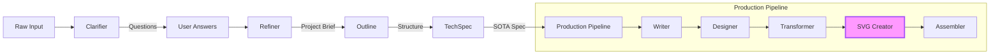
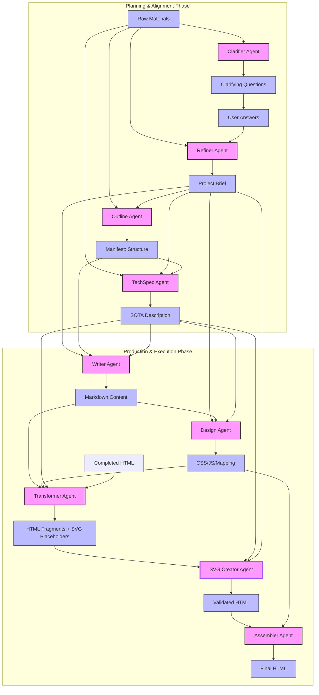
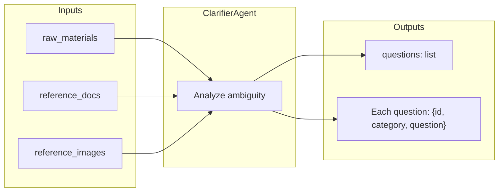
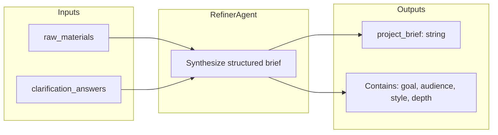
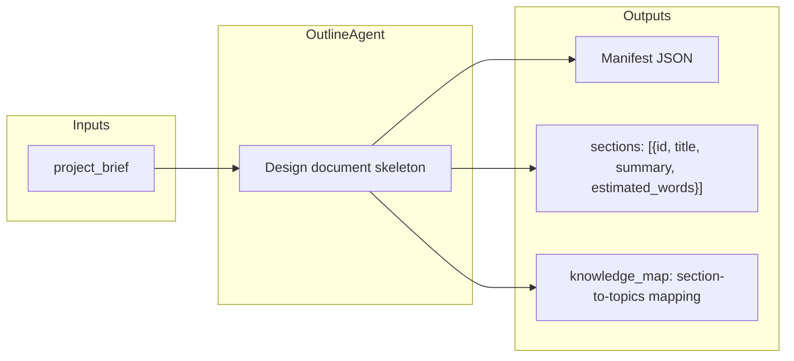
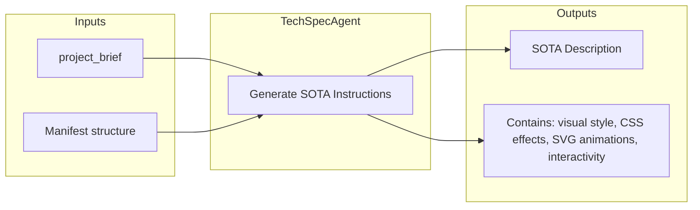
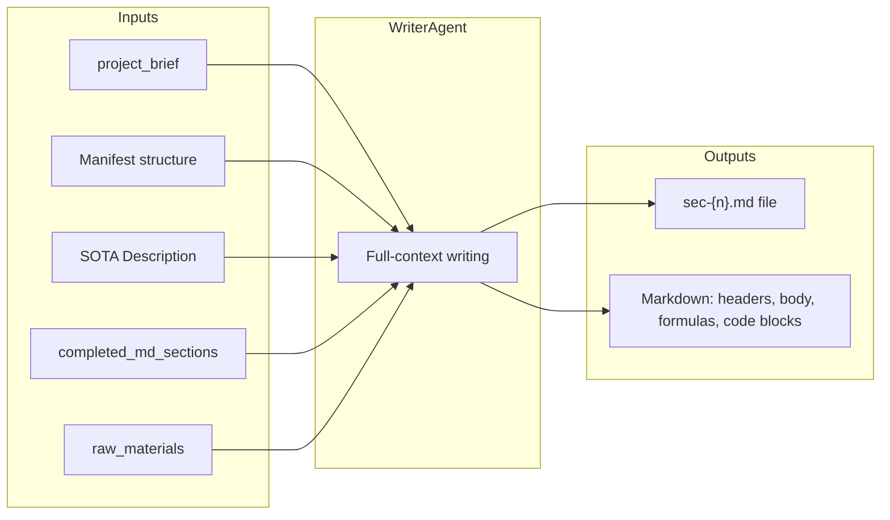
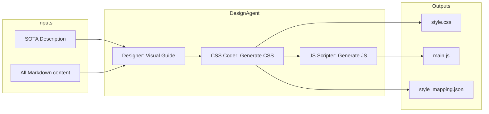
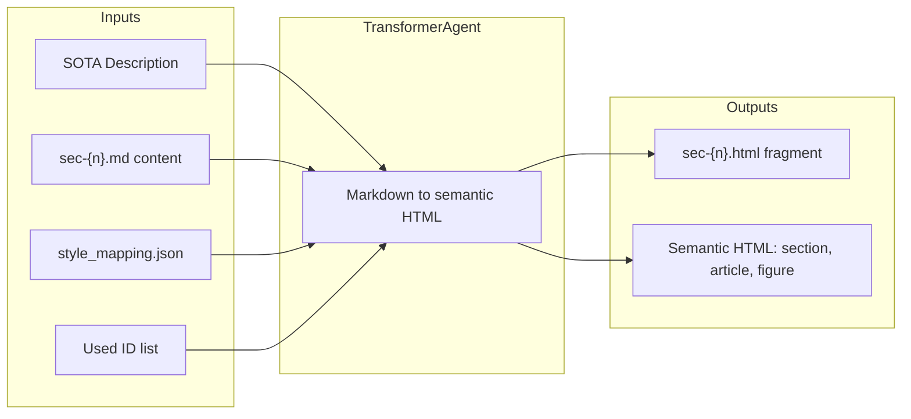
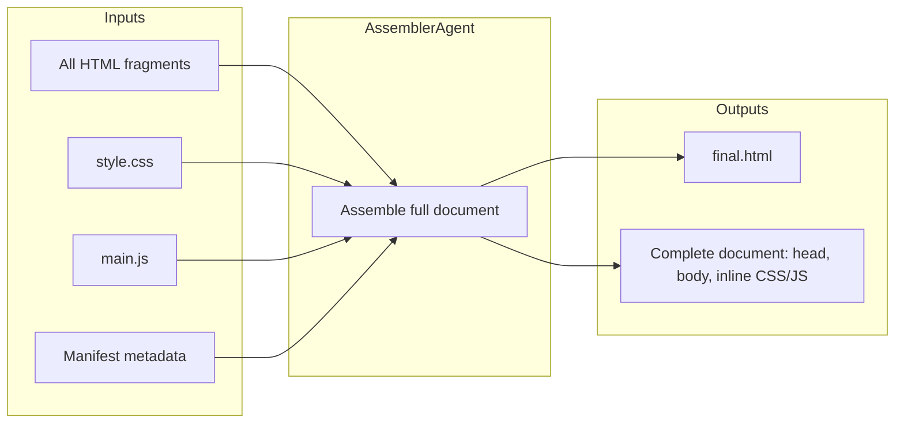

# Magnum Opus HTML Agent

An advanced, multi-stage AI agent system for generating SOTA (State-of-the-Art) technical lectures, academic documents, and long-form HTML content with rich aesthetics and interactive components.

## 🚀 Overview

Magnum Opus HTML Agent decomposes complex technical writing and design into a modular pipeline. It uses proactive clarification to eliminate ambiguity and a global "SOTA Description" to ensure consistent quality across all downstream agents.

## 🏗️ Architecture

The system follows a multi-stage decomposition pattern (ADaPT/LLM Chaining) to ensure high-quality output through specialized agents.

### Overall Workflow



### Node Input/Output Specifications

The following diagram details the specific data flow between each agent node:



## 🛠️ Core Agents

| Agent | Responsibility | Key Output |
| :--- | :--- | :--- |
| **Clarifier** | Analyzes input and asks 3-5 targeted questions to resolve ambiguity. | Clarifying Questions |
| **Refiner** | Synthesizes raw input and user answers into a domain-agnostic Project Brief. | Project Brief |
| **Outline** | Designs the high-level document structure (sections, knowledge map). | Manifest (Structure) |
| **TechSpec** | Generates detailed technical specifications (the "SOTA Description"). | Global Instructions |
| **Writer** | Generates exhaustive Markdown content for each section using full-context awareness. | Markdown Files |
| **Designer** | Creates a custom visual design system (CSS/JS) based on the TechSpec. | Style Guide / Assets |
| **Transformer** | Converts Markdown into semantic HTML fragments following strict style mappings. | HTML Fragments |
| **Assembler** | Integrates all components into a single, production-ready HTML document. | Final.html |

---

## 📊 Detailed Node Input/Output Diagrams

### 1. Clarifier Agent



### 2. Refiner Agent



### 3. Outline Agent



### 4. TechSpec Agent



### 5. Writer Agent



### 6. Design Agent



### 7. Transformer Agent



### 8. Assembler Agent



## 🎨 Design Principles

- **Deductive Reasoning**: Content is derived from first principles, ensuring deep logical consistency.
- **Rich Aesthetics**: High-end dark themes, glassmorphism, and premium typography by default.
- **Interactive SOTA**: Seamless integration of SVG animations, interactive models, and responsive layouts.
- **Domain Agnostic**: Prompts are generic; specificity is driven by the AI's understanding of user context.

## 🏁 Getting Started

1.  **Installation**:
    ```bash
    pip install -r requirements.txt
    ```
2.  **Environment**:
    Ensure your Gemini API Proxy is running (default `http://localhost:7860`).
3.  **Run App**:
    ```bash
    streamlit run app.py
    ```

## 📄 License

MIT
