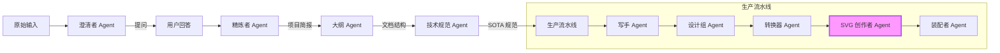
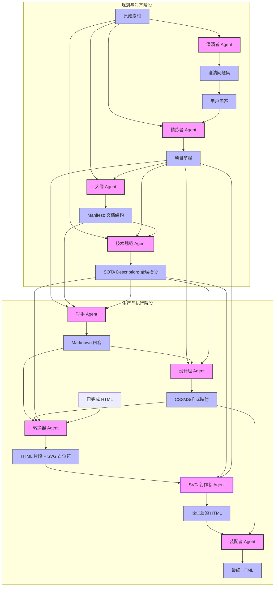
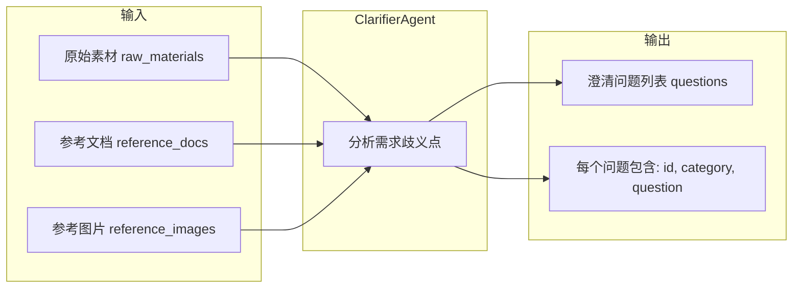
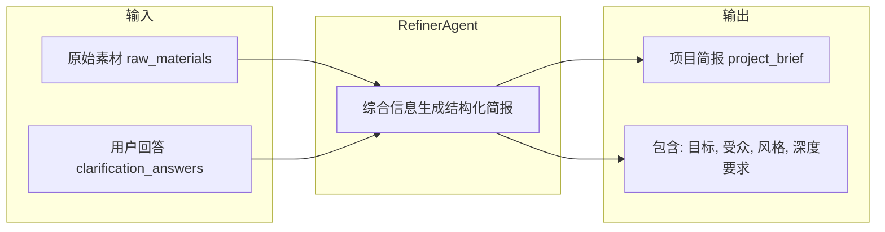
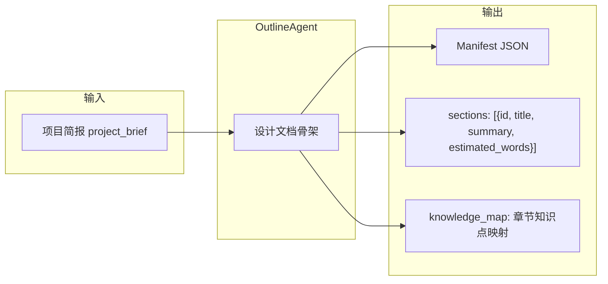
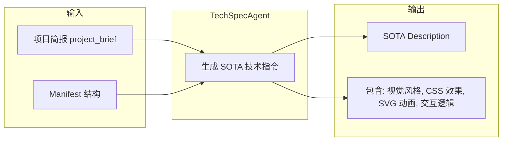
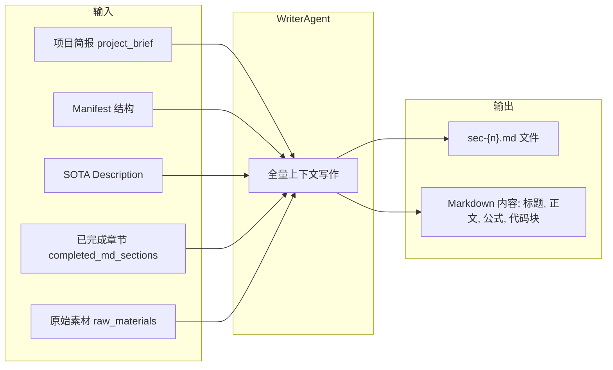
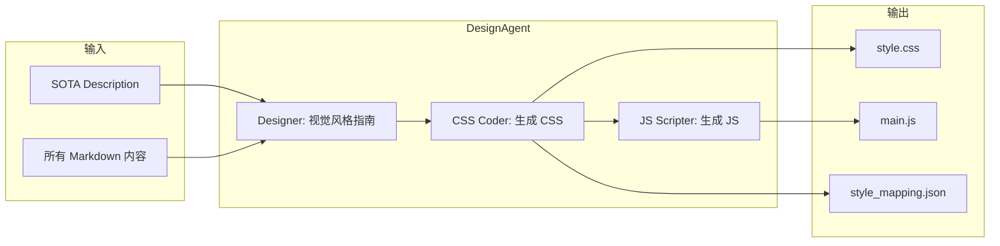
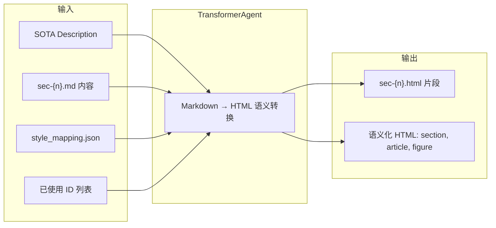
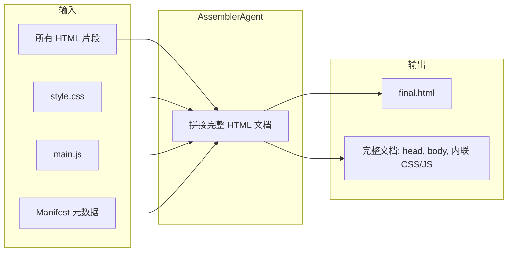

# Magnum Opus HTML Agent

一个先进的多阶段 AI Agent 系统，用于生成 SOTA (State-of-the-Art) 级别的技术讲义、学术文档和长篇 HTML 内容，具备卓越的视觉美感和交互组件。

## 🚀 项目概述

Magnum Opus HTML Agent 将复杂的技术写作和设计任务分解为模块化的流水线。它通过“主动澄清”机制消除需求歧义，并生成全局性的“SOTA Description”技术指标，确保后续所有 Agent 节点的输出质量高度一致。

## 🏗️ 系统架构

系统采用多阶段任务分解模式 (ADaPT/LLM Chaining)，通过专用 Agent 协作确保高质量产出。

### 整体工作流



### 节点输入/输出详情

下图详细描述了各 Agent 节点之间的数据流向：



## 🛠️ 核心 Agent 角色

| Agent | 职责 | 核心输出 |
| :--- | :--- | :--- |
| **Clarifier** | 分析输入，提出 3-5 个针对性问题以消除需求模糊性。 | 澄清问题集 |
| **Refiner** | 综合原始素材和用户回答，生成领域无关的详细项目简报。 | 项目简报 |
| **Outline** | 设计高水平的文档结构（章节预览、知识图谱）。 | Manifest (结构) |
| **TechSpec** | 生成详细的技术实现方案（即 "SOTA Description"）。 | 全局技术指令 |
| **Writer** | 基于全量上下文，撰写各章节详尽的 Markdown 内容。 | Markdown 文件 |
| **DesignTeam** | 根据技术规范，创建定制化的视觉设计系统（CSS/JS）。 | 风格指南 / 资产 |
| **Transformer** | 将 Markdown 转换为符合语义且严格遵循样式映射的 HTML 片段。 | HTML 片段 |
| **Assembler** | 将所有资产集成，生成最终的生产级 HTML 文档。 | Final.html |

---

## 📊 各节点输入/输出详解

### 1. 澄清者 Agent (ClarifierAgent)



### 2. 精炼者 Agent (RefinerAgent)



### 3. 大纲 Agent (OutlineAgent)



### 4. 技术规范 Agent (TechSpecAgent)



### 5. 写手 Agent (WriterAgent)



### 6. 设计组 Agent (DesignAgent)



### 7. 转换器 Agent (TransformerAgent)



### 8. 装配者 Agent (AssemblerAgent)



## 🎨 设计原则

- **演绎推理 (Deductive Reasoning)**：内容从第一性原理出发，确保深层的逻辑一致性。
- **极致美学 (Rich Aesthetics)**：预设高端暗色主题、玻璃拟态效应和优质字体系统。
- **交互式 SOTA**：无缝集成 SVG 动画、交互模型和响应式布局。
- **领域无关 (Domain Agnostic)**：提示词通用化，具体专业深度由 AI 对用户上下文的理解驱动。

## 🏁 快速开始

1.  **环境安装**:
    ```bash
    pip install -r requirements.txt
    ```
2.  **API 配置**:
    确保 Gemini API 代理服务已运行（默认地址 `http://localhost:7860`）。
3.  **启动应用**:
    ```bash
    streamlit run app.py
    ```

## 📄 许可证

MIT
