# 🧬 Magnum Opus HTML Agent

一个企业级的多 Agent AI 系统，旨在自主生产 **State-of-the-Art (SOTA)** 级别的技术文档、学术教科书和交互式讲义。Magnum Opus 通过集成递归视觉验证、深度结构规划和专用设计系统，弥合了原始 LLM 文本生成与专业出版标准之间的鸿沟。

---

## 🌟 为什么选择 Magnum Opus？

标准的 AI 生成器通常会产生“视觉盲区”代码——即 HTML 在技术上有效，但在美学上堪忧、逻辑不一致或渲染损坏。Magnum Opus 通过 **ADaPT (高级分解与规划任务)** 框架解决了这些问题：

1.  **逻辑严密性**：内容通过三阶段规划阶段，从“第一性原理”推导而来。
2.  **视觉 QA**：采用视觉语言模型 (VLM) 的递归 **Critic-Fixer (批评家-修复者) 闭环**，确保“所见即所得”。
3.  **设计一致性**：**契约驱动对齐 (CDA)** 系统确保 JavaScript、CSS 和 HTML 通过共享的选择器注册表实现完美同步。
4.  **人机协作 (Human-in-the-Loop)**：在项目简报审核和大纲验证环节设有战略性检查点。

---

## 🏗️ 系统架构：多 Agent 协作图

Magnum Opus 基于 **LangGraph** 构建，在一个有状态的、循环的工作流中编排了 14 个以上的专用 Agent。核心特性包括：
- **批评家-建议者-修复者 (Critic-Advicer-Fixer) 循环**：Markdown 内容的 AI 自我修正。
- **重写 (REWRITE) 路径**：如果内容从根本上不通过（例如语言错误），工作流将跳回写手 (Writer) 节点。
- **设计令牌分解**：`设计令牌 → CSS → JS`，确保 SOTA 设计的一致性。

```mermaid
flowchart TD
    %% 样式定义
    classDef agent fill:#f9f5ff,stroke:#7c3aed,stroke-width:2px
    classDef artifact fill:#ecfdf5,stroke:#059669,stroke-dasharray:5 5
    classDef decision fill:#fef2f2,stroke:#dc2626,stroke-width:2px
    classDef userinput fill:#fef3c7,stroke:#d97706,stroke-width:2px

    %% ========== 阶段 1: 战略规划 ========== 
    subgraph P1["Phase 1: 战略规划"]
        direction TB
        UserIntent["🎯 用户意图"]:::artifact
        UserIntent --> Clarifier["澄清者 Agent"]:::agent
        Clarifier -->|"3-5 个问题"| UserQA["👤 用户回答"]:::userinput
        UserQA --> Refiner["精炼者 Agent"]:::agent
        Refiner --> PB["📄 项目需求书"]:::artifact
        
        PB --> BriefGate{"👤 批准?"}:::decision
        BriefGate -->|驳回| Refiner
        BriefGate -->|通过| Architect["架构师 Agent"]:::agent
        
        Architect --> Manifest["📦 项目清单 (Manifest)"]:::artifact
        Manifest --> OutlineGate{"👤 批准?"}:::decision
        OutlineGate -->|驳回| Architect
        OutlineGate -->|通过| TechSpec["技术规范 Agent"]:::agent
        TechSpec --> SotaDesc["📜 SOTA 技术描述"]:::artifact
    end

    %% ========== 阶段 2: 内容生产 ========== 
    subgraph P2["Phase 2: 内容生产"]
        direction TB
        
        %% 写手循环
        SotaDesc -.-> Writer["写手 Agent"]:::agent
        Writer --> WriterGate{"章节全部完成?"}:::decision
        WriterGate -->|"否: 下一章"| Writer
        WriterGate -->|"是"| MdQA
        
        %% Markdown QA (批评家-建议者-修复者)
        subgraph MdQABox["Markdown 质检循环"]
            direction LR
            MdQA["批评家 (Critic)"]:::agent -->|"修改 (MODIFY)"| Advicer["建议者 (Advicer)"]:::agent
            Advicer --> Fixer["修复者 (Fixer)"]:::agent
            Fixer -->|"补丁"| MdQA
        end
        
        MdQA -->|"重写 (REWRITE)"| Writer
        MdQA -->|"通过 / 达最大迭代"| MdReview{"👤 Markdown 审核"}:::decision
        MdReview -->|通过| DesignTokens["设计令牌 Agent"]:::agent
        MdReview -->|驳回 + 反馈| MdQA
        
        %% 设计阶段
        DesignTokens --> Tokens["🎨 design_tokens.json"]:::artifact
        Tokens --> CSSGen["CSS 生成器"]:::agent
        Tokens -.-> JSGen["JS 生成器"]:::agent
        CSSGen --> Assets["🗂️ 样式表 + 映射"]:::artifact
        JSGen --> AssetJS["📜 main.js"]:::artifact
        
        %% 转换器循环
        Assets -.-> Transformer["转换器 Agent"]:::agent
        Transformer --> TransGate{"全部转换完成?"}:::decision
        TransGate -->|"否: 下一页"| Transformer
        TransGate -->|"是"| ImgSourcing["图片采购 Agent"]:::agent
        ImgSourcing --> Assembler["装配者 Agent"]:::agent
    end
    
    %% ========== 阶段 3: 视觉质检 ========== 
    subgraph P3["Phase 3: 视觉验收"]
        direction TB
        Assembler --> FinalHTML["📄 final.html"]:::artifact
        FinalHTML --> VisualQA["视觉批评家 (VLM)"]:::agent
        VisualQA --> VQAGate{"发现视觉 Bug?"}:::decision
        VQAGate -->|"是: 修复"| VFixer["视觉修复者"]:::agent
        VFixer -->|"补丁"| Assembler
        VQAGate -->|"否: 通过"| Done["✅ 部署"]:::artifact
    end

    %% 阶段间的连接
    P1 --> P2
    P2 --> P3
```



---

## 🛠️ 核心 Agent 节点说明

| Agent | 核心能力 | SOTA 产物 |
| :--- | :--- | :--- |
| **澄清者 (Clarifier)** | 通过 3-5 个针对性提问消除需求歧义。 | `clarification_questions.json` |
| **精炼者 (Refiner)** | 将用户输入 + 澄清问答合成为结构化的项目简报。 | 项目简报 (Markdown) |
| **架构师 (Architect)** | 设计深层知识架构，防止内容“浅表化”。具备 JSON 自动修复能力。 | `manifest.json` |
| **技术规范 (TechSpec)** | 生成包含设计规范和交互要求的执行契约。 | SOTA 技术描述 |
| **写手 (Writer)** | 全量上下文感知；确保万字长文逻辑连贯。支持流式生成。 | 详尽的 Markdown (`sec-n.md`) |
| **MD 质检 (Markdown QA)** | AI 自动纠错 + Markdown 内容的人工审核环路。 | 验证后的 Markdown |
| **设计令牌 (DesignTokens)** | 生成设计变量作为单一真理来源 (SOTA Pattern)。 | `design_tokens.json` |
| **CSS 生成器 (CSSGenerator)** | 基于 Design Tokens 生成产品级 CSS，确保视觉一致性。 | `style.css`, `style_mapping.json` |
| **JS 生成器 (JSGenerator)** | 独立生成交互功能脚本，支持 TOC、主题切换等。 | `main.js` |
| **转换器 (Transformer)** | 约束性 MD→HTML 编译，确保 HTML 语义化。 | 带样式的 HTML 片段 (`sec-n.html`) |
| **图片采购 (Image Sourcing)** | 基于 VLM 的全球图片搜索与智能筛选。 | 下载的图片资产 |
| **装配者 (Assembler)** | 将 HTML 片段拼接成最终的完整文档。 | `final.html` |
| **视觉批评家 (Critic)** | 基于 VLM 的视觉巡检，具备验证链 (CoV) 机制。 | 高保真的红框 Bug 报告 |
| **代码修复者 (Fixer)** | 基于视觉坐标的源码外科手术式修补。 | 精确的源码补丁 |

---

## 📊 Agent 输入/输出契约 (数据模式)

本节详细记录了每个 Agent 的精确输入/输出数据契约和核心功能，对于调试、扩展和理解数据流至关重要。

---

### 阶段 1: 规划类 Agent

#### 1. 澄清者 Agent (Clarifier)
| 项目 | 描述 |
| :--- | :--- |
| **功能** | 分析用户的初始输入，生成 3-5 个针对性的澄清问题以消除歧义。问题按受众、深度、风格、交互元素等维度分类，便于后续需求精炼。 |
| **输入** | `AgentState.raw_materials` (字符串), `AgentState.images` (base64列表), `AgentState.reference_docs` (路径列表) |
| **输出** | `AgentState.clarifier_questions` → `list[ClarificationQuestion]` |

```json
// ClarificationQuestion 数据结构
[
  {"id": "q1", "category": "audience", "question": "本文档的主要受众是谁?"},
  {"id": "q2", "category": "depth", "question": "内容应该是入门级还是高级?"}
]
```

#### 2. 精炼者 Agent (Refiner)
| 项目 | 描述 |
| :--- | :--- |
| **功能** | 将用户原始输入 + 澄清问答合成为结构化的 **项目需求书 (Project Brief)**。需求书包含 8 个标准化章节：概述、目标受众、目标、范围、教学法、视觉需求、语调、关键主题。支持通过用户反馈进行迭代精炼。 |
| **输入** | `AgentState.raw_materials`, `AgentState.clarifier_answers` (dict[问题ID→回答]), `AgentState.user_brief_feedback` (可选) |
| **输出** | `AgentState.project_brief` → 结构化 Markdown (800-1500字) |

#### 3. 大纲 Agent (Outline)
| 项目 | 描述 |
| :--- | :--- |
| **功能** | 设计文档的高层结构 (5-10 个章节)，遵循逻辑学习进阶顺序。每个章节包含 ID、标题、50-100 字摘要和预估字数。生成 `knowledge_map` 将章节与核心概念关联。不包含技术实现规范。 |
| **输入** | `AgentState.project_brief`, `AgentState.user_outline_feedback` (可选) |
| **输出** | `AgentState.manifest` → `Manifest` 对象, 保存为 `outline.json` |

```json
// Manifest 数据结构 (outline.json)
{
  "project_title": "文档标题",
  "author": "Magnum Opus AI",
  "sections": [
    {"id": "sec-1", "title": "章节标题", "summary": "50-100字摘要...", "estimated_words": 2500}
  ],
  "knowledge_map": {"sec-1": ["概念A", "概念B"]}
}
```

#### 4. 技术规范 Agent (TechSpec)
| 项目 | 描述 |
| :--- | :--- |
| **功能** | 生成全面的 **SOTA 技术描述** (300-500字)，包含：内容指南（推理风格、严谨度）、视觉设计系统（配色、字体）、交互元素规格（动画、效果）、无障碍要求。此描述作为所有下游生产 Agent 的执行契约。 |
| **输入** | `AgentState.manifest` (来自大纲), `AgentState.project_brief` |
| **输出** | `AgentState.manifest.description` → SOTA 技术描述 (Markdown) |

---

### 阶段 2: 生产类 Agent

#### 5. 写手 Agent (Writer)
| 项目 | 描述 |
| :--- | :--- |
| **功能** | 生成详尽的 Markdown 内容（每章 2000-5000 字），具备全量上下文感知能力。严格遵循 SOTA 技术描述中的推理风格和严谨度要求。支持特殊块语义（如 `:::note`, `:::warning`）和 LaTeX 数学公式。每次调用撰写一个章节，并可访问之前已完成的所有章节以确保逻辑连贯。 |
| **输入** | `AgentState.manifest`, `AgentState.raw_materials`, 已完成的 `completed_md_sections` |
| **输出** | `md/sec-{id}.md` 文件, 更新 `AgentState.completed_md_sections` |

#### 6a. 设计令牌 Agent (Design Tokens)
| 项目 | 描述 |
| :--- | :--- |
| **功能** | 生成一个全面的、与平台无关的设计令牌规范，作为所有视觉决策的**单一真理来源**。包含颜色原语/语义、字体比例、间距、效果（阴影、半径）和组件特定令牌。在 CSS/JS 生成之前运行。 |
| **输入** | `AgentState.manifest`, `AgentState.project_brief`, 内容预览 |
| **输出** | `design_tokens.json`, 更新 `AgentState.design_tokens` |

```json
// 设计令牌数据结构 (design_tokens.json)
{
  "colors": {"primitive": {"blue-500": "#3b82f6"}, "semantic": {"accent": "#3b82f6"}},
  "typography": {"font-family": {"heading": "'Inter', sans-serif"}, "font-size": {"base": "1rem"}},
  "spacing": {"4": "1rem", "8": "2rem"},
  "effects": {"shadow": {"md": "0 4px 6px rgba(0,0,0,0.1)"}, "border-radius": {"lg": "0.5rem"}},
  "components": {"card": {"background": "var(--color-bg-secondary)", "padding": "var(--spacing-6)"}}
}
```

#### 6b. CSS 生成器 Agent (CSS Generator)
| 项目 | 描述 |
| :--- | :--- |
| **功能** | 基于设计令牌创建产品级 CSS。将所有令牌转换为 CSS 自定义属性 (`:root`)，实现深色模式、响应式布局、BEM 命名和现代 CSS 特性。输出 `style_mapping.json` 以供转换器协调。 |
| **输入** | `AgentState.design_tokens`, `AgentState.manifest.description`, 内容预览 |
| **输出** | `assets/style.css`, `style_mapping.json`, 更新 `AgentState.style_mapping` |

```json
// 样式映射数据结构 (style_mapping.json)
{
  "rules": [
    {"markdown_pattern": "important_card", "css_selector": "section.card.card--important"},
    {"markdown_pattern": "formula_block", "css_selector": "div.math-block"}
  ]
}
```

#### 6c. JS 生成器 Agent (JS Generator)
| 项目 | 描述 |
| :--- | :--- |
| **功能** | 为交互式文档功能创建产品级 JavaScript。实现：带滚动监听的目录生成、localStorage 持久化的主题切换、阅读进度条、代码块复制按钮、MathJax 初始化、图片懒加载、可折叠章节。使用现代 ES6+ 语法，不依赖 jQuery。 |
| **输入** | `AgentState.manifest`（含 description、section metadata）, `completed_md_sections` 内容预览 |
| **输出** | `assets/main.js`, 更新 `AgentState.js_path` |

> **契约选择器 (Contract Selectors)**: JS 生成器期望最终 HTML 中存在以下 ID/类：
> `#theme-toggle`, `#toc-container`, `#progress-bar`, `.code-block`, `.math-block`

#### 7. 转换器 Agent (Transformer)
| 项目 | 描述 |
| :--- | :--- |
| **功能** | 将 Markdown 章节转换为 HTML 片段。严格遵守 `StyleMapping` 契约以应用正确的 CSS 类。确保 HTML 语义化结构（nav, article, section, aside）。为图表生成内联 SVG，为真实图片使用 `img-placeholder` 占位符。 |
| **输入** | `md/sec-{id}.md`, `AgentState.style_mapping`, `AgentState.css_path`（完整 CSS 以供类名参考）, **`AgentState.js_path`**（JS 包含目标 ID/选择器契约）, 已完成的 `completed_html_sections` 以确保风格一致性 |
| **输出** | `html/sec-{id}.html` 片段, 更新 `AgentState.completed_html_sections` |

> **契约驱动对齐 (CDA)**: 转换器会读取 `main.js` 以确保生成的 HTML 元素（如 `#theme-toggle`, `.toc`）与 JavaScript 期望的选择器相匹配。

#### 8. 图片采购 Agent (Image Sourcing)
| 项目 | 描述 |
| :--- | :--- |
| **功能** | 扫描 HTML 中带有 `data-img-id` 和 `data-description` 属性的 `img-placeholder` 占位符。利用 VLM 生成搜索查询，通过无头浏览器进行 Google 图片搜索，下载候选图，并再次使用 VLM 筛选最佳匹配。最后将占位符替换为真实的 `` 标签。 |
| **输入** | `AgentState.completed_html_sections` (扫描 `img-placeholder` 占位符) |
| **输出** | 下载图片到 `assets/images/`, 更新 HTML 中的 `` |

#### 9. 装配者 Agent (Assembler)
| 项目 | 描述 |
| :--- | :--- |
| **功能** | 使用基础模板将所有 HTML 片段拼接成 `final.html`。注入 CSS 和 JS 资产，构建导航目录，并执行 BeautifulSoup 验证。如果验证失败，可调用 AI 进行自动修复。最后将完整文档保存至工作区。 |
| **输入** | 所有 `html/sec-{id}.html` 片段, `assets/style.css`, `assets/main.js` |
| **输出** | `final.html` (完整文档), 更新 `AgentState.final_html_path` |

---

### 阶段 3: 质检类 Agent

#### 10. Markdown 质检 Agent (编排者)
| 项目 | 描述 |
| :--- | :--- |
| **功能** | 编排一个三阶段内部质检循环：**批评家 (Critic) → 建议者 (Advicer) → 修复者 (Fixer)**。针对 `MODIFY` 判定执行最多 3 次迭代。若判定为 `REWRITE`，则触发 `rewrite_needed` 标识，将内容发回写手 (Writer) 重新生成。 |
| **输入** | 所有 `md/sec-{id}.md`, `AgentState.manifest`, `AgentState.raw_materials`, `AgentState.project_brief` |
| **输出** | `AgentState.md_qa_needs_revision`, `AgentState.rewrite_needed`, `AgentState.rewrite_feedback`, 原地应用补丁 |

##### 10a. Markdown 批评家 (子 Agent)
| 项目 | 描述 |
| :--- | :--- |
| **功能** | 严厉的科学编辑。对照清单 (Manifest) 章节、`knowledge_map`、项目需求书和原始素材对合并后的 Markdown 内容进行严格审计。核查点：(1) 清单对齐——摘要/知识点是否全部覆盖？(2) 技术严谨性——数学公式是否到位？(3) 语言一致性——是否符合需求书要求的语言？(4) 格式——无损坏的 Mermaid/SVG。 |
| **输入** | 合并后的 `md/*.md` 内容, `AgentState.manifest` (含章节摘要), `AgentState.project_brief`, `AgentState.raw_materials` |
| **输出** | 包含单文件反馈的 JSON 判定结果 |

```json
// 批评家判定数据结构
{
  "verdict": "APPROVE" | "MODIFY" | "REWRITE",
  "feedback": "说明错误原因的总体评估",
  "section_feedback": {
    "phase-01.md": "缺少清单摘要要求的 KCL 公式推导。",
    "phase-02.md": "艾因霍芬定律证明不完整。"
  }
}
```

##### 10b. Markdown 建议者 (子 Agent)
| 项目 | 描述 |
| :--- | :--- |
| **功能** | 解决方案架构师。将批评家的高层反馈转化为**可操作的、按文件划分的编辑指令**。原则：(1) 指令必须具体——如“在 Y 之后添加 X”，而非“优化语气”。(2) 仅包含需要修改的文件。 |
| **输入** | 批评家的反馈字符串, 文件列表, 合并后的 Markdown 内容 |
| **输出** | `文件名 → 建议字符串` 的 JSON 映射 |

```json
// 建议者输出结构
{
  "phase-01.md": "1. 在 '## 威尔逊中心电极' 后添加 KCL 推导。2. 包含公式：$I_{LA} + I_{RA} + I_{LL} = 0$",
  "phase-02.md": "1. 结合向量图扩展艾因霍芬定律的证明。"
}
```

##### 10c. Markdown 修复者 (子 Agent)
| 项目 | 描述 |
| :--- | :--- |
| **功能** | 高精度内容补丁 Agent。生成包含 `search` (精确现有文本) 和 `replace` (新文本) 块的 JSON 补丁。使用字节级匹配以防止幻觉。 |
| **输入** | 目标文件内容, 建议者针对该文件的建议, 可选上下文 |
| **输出** | JSON 补丁列表 |

```json
// 修复者补丁结构
{
  "thought": "KCL 章节在第 45 行结束，我将在最后一段后添加。",
  "patches": [
    {
      "search": "威尔逊中心电极的电位理论上为零。",
      "replace": "威尔逊中心电极的电位理论上为零。\n\n### KCL 推导\n根据基尔霍夫电流定律：\n$$I_{LA} + I_{RA} + I_{LL} = 0$$"
    }
  ]
}
```

---

#### 11. 视觉验收 Agent (编排者)
| 项目 | 描述 |
| :--- | :--- |
| **功能** | 双 Agent 视觉检测循环：**VLM 批评家 → 代码修复者**。在无头浏览器中渲染 HTML 章节，捕捉带红色 "PART X" 标记的分段截图，发送至 VLM。持续修复直到通过或达到 3 次迭代。可触发 `vqa_needs_reassembly` 要求装配者重跑。 |
| **输入** | `AgentState.completed_html_sections`, `AgentState.css_path`, `AgentState.js_path`, `AgentState.final_html_path` |
| **输出** | `AgentState.vqa_needs_reassembly` (bool), 修补后的 HTML/CSS/JS 文件 |

##### 11a. VLM 批评家 (子 Agent)
| 项目 | 描述 |
| :--- | :--- |
| **功能** | 视觉语言模型督查。接收带红色徽章标记的多段截图。检测：布局溢出、对齐错误、图片破损、对比度问题、渲染 Bug。引用 PART 编号进行精确逻辑定位。 |
| **输入** | 截图列表 (PNG), 章节 HTML 代码 (带行号), CSS 代码, JS 代码, 可编辑文件列表 |
| **输出** | JSON 问题清单 |

```json
// VLM 批评家输出结构
{
  "verdict": "PASS" | "FAIL",
  "issues": [
    {"part": 2, "file": "html/sec-3.html", "location": "右上角", "description": "LaTeX 公式溢出容器"},
    {"part": 3, "file": "assets/style.css", "location": "底部", "description": "页脚文本对比度不足"}
  ]
}
```

##### 11b. 代码修复者 (子 Agent)
| 项目 | 描述 |
| :--- | :--- |
| **功能** | 代码外科手术。一次接收一个视觉问题，分析目标文件，生成极简的 `replace`、`insert` 或 `delete` 补丁。若无法修复则返回 `SKIPPED`。 |
| **输入** | 来自 VLM 批评家的单个问题, 目标文件全量内容 (HTML/CSS/JS) |
| **输出** | JSON 修复指令 |

```json
// 代码修复者输出结构
{
  "status": "FIXED" | "SKIPPED",
  "file": "assets/style.css",
  "fix": {
    "type": "replace",
    "target": ".math-block { overflow: visible; }",
    "replacement": ".math-block { overflow-x: auto; max-width: 100%; }"
  }
}
```

---

## � 技术深挖：SOTA 背后的黑科技

### 1. 双 Agent 视觉 QA (Critic-Fixer)
与纯文本 Agent 不同，**视觉批评家**在无头浏览器 (**DrissionPage**) 中渲染页面并实时“观察”。如果检测到渲染 Bug（例如 LaTeX 公式与图表重叠），它会生成一份包含**坐标红框**的报告。**代码修复者**随后利用我们专有的**目标补丁算法**更新源码，而不需要重新生成整个文件。

### 2. 契约驱动对齐 (CDA)
为了防止设计师生成的 JS 找不到转换器生成的 HTML 元素，我们实施了**选择器注册契约**。该契约确保：
- `main.js` 准确知道装配者会提供哪些 ID（如 `#theme-toggle`）。
- `style.css` 仅使用 `style_mapping.json` 中定义的特定类名。

### 3. 强韧的 SSE 流式输出
我们的 `GeminiClient` 通过 `stream=True` 支持 **Server-Sent Events (SSE)** 流式传输。为了防止长请求导致的 500 SSL/EOF 超时错误，所有 Agent 均已启用流式生成：
- 能够稳定生成海量技术章节（单次 6.4 万+ Token）。
- 实时监控 AI 的“思考过程” (Think-Preview-Action)。
- 在关键的合成阶段，具备极强的抗连接中断能力。
- **有效避免了非流式调用时常见的 SSL EOF 错误**。

### 4. 设计令牌架构 (NEW)
遵循 SOTA 前端开发实践，我们将设计阶段分解为三个专业 Agent：
1. **设计令牌 Agent**: 生成平台无关的令牌规范。
2. **CSS 生成器 Agent**: 将令牌转换为 CSS 并实现样式表。
3. **JS Generator Agent**: 独立生成交互功能（可与 CSS 并行生成）。

这种分离确保了：
- **单一真理来源**: 所有视觉决策均源自 `design_tokens.json`。
- **高度一致性**: CSS 和 JS 绝不会与设计规范产生偏差。
- **模块化**: 更易于调试和功能扩展。

### 5. 人机协作反馈传播 (NEW)
审批节点的反馈现在已能**正确传播**至各 Agent：
- `user_brief_feedback` → 精炼者 Agent
- `user_outline_feedback` → 架构师 Agent (支持低温度模式下的严格遵循)
- `user_markdown_feedback` → Markdown 质检 Agent (触发定向修复)

---

## 💻 开发者安装指南

### 环境要求
- Python 3.10+
- [Micromamba](https://mamba.readthedocs.io/en/latest/installation/micromamba-installation.html) (推荐)
- Gemini API 代理 (默认: `http://localhost:7860`)

### 环境搭建
```bash
# 1. 创建环境
micromamba create -n opus python=3.10
micromamba activate opus

# 2. 安装核心依赖
pip install -r requirements.txt

# 3. 安装无头浏览器
playwright install chromium
```

---

## 🚦 快速开始

### 1. Streamlit 仪表盘 (GUI)
最直观的方式，包含全流程的人机协作检查点：
```bash
streamlit run app.py
```

### 2. CLI 全自动流水线
适用于无头、批量的生产任务：
```bash
python main.py --input "对讲义主题的简短描述"
```

### 3. 验证与测试
验证 SOTA 流水线中的特定组件：
```bash
# 测试视觉 QA 的 Critic-Fixer 闭环
python scripts/test_visual_qa.py

# 测试流式传输的稳定性
python scripts/test_streaming.py
```

---

## 📂 项目结构
```text
.
├── src/
│   ├── agents/          # 专业 AI Agent (写手, 设计师, VQA 等)
│   ├── core/            # SSE 客户端, Pydantic 类型定义, 状态管理
│   └── orchestration/   # LangGraph 状态图定义
├── workspace/           # 持久化任务存储 (Markdown -> HTML -> 资产)
├── scripts/             # 单元测试与流水线验证 CLI 工具
└── app.py               # 基于 Streamlit 的编排仪表盘
```

## 📄 许可证
内部 SOTA 开发项目。保留所有权利 (高级 Agent 编码团队)。
