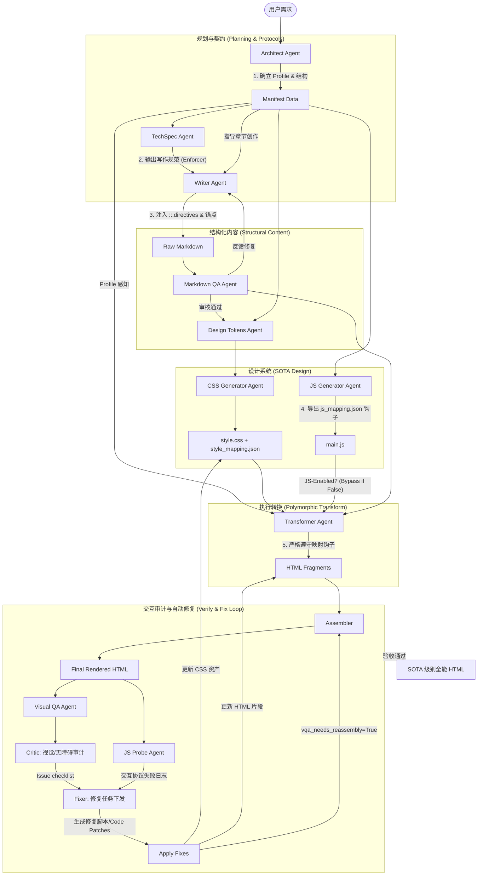

# HTML Writing Agent SOTA 升级方案：多态生成与交互式审核架构

本方案旨在解决长 HTML 文档（讲义、幻灯片、仪表盘、博客等）在生成过程中的一致性、功能性与审美协调性问题。

## 1. 核心改进目标

| 维度 | 现状 | 目标方案 |
| :--- | :--- | :--- |
| **适配性** | 单一转换逻辑，无法适配多样化格式 | **多态布局引擎**：基于 `FormatProfile` 的分路转换，实现幻灯片/博客/仪表盘的一键切换。 |
| **语义创作** | Markdown 过于扁平，易丢失组件信息 | **结构化创作 (Component-Aware)**：引入 `:::directive` 协议与视觉锚点，为下游组件精准“占位”。 |
| **交互逻辑** | 静态生成的 JS，难以维护且不稳定 | **混合注册制 (Hybrid Registry)**：本地 SOTA 引擎库 + LLM 动态胶水代码；支持 **Zero-JS (纯净模式)** 自动回退。 |
| **视觉审核** | 仅支持静态快照，无法覆盖交互态 | **交互式 VQA**：基于 **Playwright MCP** 的剧本驱动审核；集成 **Chrome DevTools MCP** 深度审计日志。 |
| **功能审计** | 缺乏黑盒测试，无法验证逻辑闭环 | **JS 功能探测 (JS Probe)**：全自主探测代理，验证点击、滚动及状态切换协议的真实有效性。 |

## 2. 系统架构 (Mermaid)

## 3. 详细技术方案

### 3.1 全局 CSS：语义化分层架构
为了确保改动方便且具备一致性，CSS 采用 **Tokens -> Semantic -> Component** 模式：
1.  **Tokens (Primitive)**: 定义基础色板、字体缩放、间距单位。
2.  **Semantic (语义层)**: 定义 `--color-bg-primary`, `--color-text-accent`, `--font-size-h1` 等，直接映射到文档逻辑。
3.  **Layout Layers**: 针对不同 Profile 注入不同的布局基类（例如 `.layout-slide` 强制 16:9 视口，`.layout-blog` 采用长流式布局）。

### 3.2 JavaScript：混合注册制 (Hybrid Registry)
为了兼顾稳定性与灵活性，采用 **本地引擎 + 动态胶水** 的生成模式：
1.  **Core Libraries (Local)**: 复杂且通用的逻辑（如 Slide Deck Controller, TOC Spy, Lightbox）存储在 `src/assets/js_modules/*.js`，作为经过验证的“引擎”。
2.  **Glue & Config (LLM)**: `JSGenerator` 负责生成配置代码（如 `new SlideDeck({ loop: true })`）和特定的 Ad-hoc 交互逻辑（如章节特有的 SVG 动画）。
3.  **语义钩子协议 (Semantic Hook Protocol)**: 建立 `js_mapping.json` 契约，定义组件所需的 HTML 结构与 Data Attributes。`Transformer` 必须严格遵守此协议以实现 JS 的自动挂载。

### 3.3 纯净化支持：解耦式交互逻辑 (Decoupled Interaction)
针对“纯 HTML/离线文档”需求，支持零 JS 的生成模式：
1.  **逻辑旁路化**: 在 `Manifest.config` 中开关 `js_enabled`，当关闭时，编排层自动跳过所有 JS 相关节点。
2.  **CSS 回退方案**: 在无 JS 模式下，`Transformer` 会自动渲染基于 CSS 的静态布局（如长流式布局），确保内容在不牺牲审美的前提下依然可读。

### 3.4 交互式 VQA：Playwright MCP 集成
当前的静态长文档审核改为 **剧本驱动 (Playbook-driven)**，并引入 **Playwright MCP**：
1.  **VQA Playbook**: 定义一系列动作。如 `Slide` 模式下：`[Init, Next_Slide, Next_Slide, Open_TOC]`。
2.  **多态快照**: VQA 代理调用 Playwright MCP 执行动作并截图。Playwright 的无障碍树 (Accessibility Tree) 将辅助 LLM 更精准地定位元素。

### 3.5 JS 功能审计：JS Probe Agent
引入专门的探测代理（JS Probe Agent），利用 **Playwright MCP** 的工具集：
1.  **功能探测 (Functionality Probing)**：通过结构化的 Playwright 工具指令模拟用户操作。
2.  **协议验证**：验证点击、滚动等行为是否触发了预期的 DOM 状态变化。
3.  **反馈闭环**：结合 Chrome DevTools MCP 获取的日志，将失败细节通过 Fixer 进行修复。

#### 3.4.1 动画专项审计 (Animation Logic Verification)
针对动态转场与交互动画，引入“时间轴探测”机制：
- **逐帧探测 (Property Sniffing)**: JS Probe 实时监控 `getComputedStyle(ele)` 中的 `opacity`、`transform` 等属性。若在交互触发后属性保持恒定，则判定为“死动画”。
- **时序快照 (Burst Snapshots)**: VQA Agent 在动画执行周期内进行多帧连拍，Critic Agent 审核 [起始-过渡-终点] 的三态一致性。
### 3.6 MCP 辅助增强：加速 VQA 与功能审计
为了避免“重复造轮子”，在验证阶段引入成熟的 **MCP (Model Context Protocol)** 服务作为辅助：
1.  **Chrome DevTools MCP**: 当 `JS Probe` 探测到异常时，直接调用此 MCP 获取控制台日志 (Console Logs) 和网络请求状态，作为上下文发送给 `Fixer`。
2.  **Sequential Thinking MCP**: 在生成复杂的 `vqa_playbook` 时，利用此 MCP 引导 LLM 进行多步逻辑推理，确保交互测试覆盖所有关键路径。
3.  **标准化契约**: 参考开源的 Puppeteer/Playwright MCP 工具定义（Schema），为 DrissionPage 编写标准化的交互函数接口。

### 3.7 创作层升级：结构化 Markdown (Component-Aware Drafting)
为了确保 Markdown 能够完美承载下游的复杂组件，对创作阶段进行结构化升级：
1.  **指令占位符协议 (Directive Protocol)**: Writer 引入 `:::component_type {config} ... :::` 语法。例如，为动态 SVG 留出 `:::svg-logic {id: "dipole-anim"} :::` 空间，明确渲染位置。
2.  **视觉锚点定位 (Visual Anchoring)**: 使用显式语法 `![[query: specific search term]]` 标记图片插入点，确保搜图 Agent 能精准替换。
3.  **排版契约遵循 (Layout Protocol)**: Writer 将根据 TechSpec 确立的 `FormatProfile` 调整文风与结构。
    *   *Slide 模式*: 多用列表、短句，强制 `##` 标题作为分页。
    *   *Dashboard 模式*: 使用特定容器包裹指标与图表。

## 4. 节点修改与增删说明 (Code-level Changes)

针对上述 SOTA 方案，以下是各核心代码模块的具体修改计划：

### 4.1 核心数据结构 (Core Layer)
- **[Modify] [types.py](file:///Users/jay/LocalProjects/long_html_writing_agent/src/core/types.py)**:
    - `SectionInfo.metadata`: 增加 `interaction_spec` 字段（包含 `triggers`, `animations`, `widgets`）。
    - `Manifest.config`: 增加 `format_profile` 枚举以及 **`js_enabled`** 布尔开关。
    - `AgentState`: 增加 `vqa_playbook` (List[Dict])；增加 **`js_mapping`** (StyleMapping 变体) 用于存储 JS 钩子契约。

### 4.2 规划与设计 Agent (Planning & Design Agents)
- **[Modify] [architect_agent.py](file:///Users/jay/LocalProjects/long_html_writing_agent/src/agents/architect_agent.py)**:
    - 更新 `ARCHITECT_SYSTEM_PROMPT`，强制模型在生成 `Manifest` 时根据用户意图锁定一个 `format_profile`。
- **[Modify] [techspec_agent.py](file:///Users/jay/LocalProjects/long_html_writing_agent/src/agents/techspec_agent.py)**:
    - **角色转型**：从生成描述文本转变为 **"Format Protocol Enforcer"**。
    - **职责**：根据 `format_profile` 生成针对 Writer 的具体**写作规范**（如："Slide 模式下只能使用 H2 作为页标题，正文禁止超过 150 字"）。
- **[Modify] [design_tokens_agent.py](file:///Users/jay/LocalProjects/long_html_writing_agent/src/agents/design_tokens_agent.py)**:
    - 升级为“感知布局”的设计系统，生成的 Tokens 将包含 Profile 特定的变量（如 Slide 的转场时间、Dashboard 的栅格间距）。
- **[Modify] [css_generator_agent.py](file:///Users/jay/LocalProjects/long_html_writing_agent/src/agents/css_generator_agent.py)**:
    - 引入 **Layout-Base** 模板，在生成的 CSS 开头自动注入对应 Profile 的基础布局样式。
- **[Modify] [js_generator_agent.py](file:///Users/jay/LocalProjects/long_html_writing_agent/src/agents/js_generator_agent.py)**:
    - **混合注册制**：读取 `src/assets/js_modules/` 下的本地核心库文件。
    - **生成 js_mapping.json**：显式输出该交互模块所需的 HTML 埋点规范，供 Transformer 使用。
    - Prompt 调整：指导模型生成实例化代码（Glue Code）和特定交互逻辑。

### 4.2.5 创作层 Agent (Drafting Agents)
- **[Modify] [writer_agent.py](file:///Users/jay/LocalProjects/long_html_writing_agent/src/agents/writer_agent.py)**:
    - **注入协议感知**: 系统提示词增加对 `InteractionSpec` 的解析要求。
    - **结构化输出**: 强制在 Markdown 中使用 `:::directive` 块为 SVG 和自定义交互组件预留挂载点。
- **[Modify] [markdown_qa_agent.py](file:///Users/jay/LocalProjects/long_html_writing_agent/src/agents/markdown_qa_agent.py)**:
    - **协议审计员化 (Protocol Auditor)**: 增加对 `InteractionSpec` 与 `FormatProfile` 的双重审计。
    - **占位符核验**: 检查 `:::directive` 块是否与 Manifest 描述 1:1 匹配；验证 `![[query:...]]` 锚点是否包含了预定义的搜索词。
    - **布局规范检查**: 在 Slide 模式下强制检查 `##` 分页逻辑；在 Dashboard 模式下核验卡片容器语法。
    - **Fixer 增强**: 允许 Fixer 在检测到钩子缺失时，根据 `js_mapping` 协议自动补全 Data Attributes 或容器占位符。

### 4.3 执行与转换 Agent (Execution Agents)
- **[Modify] [transformer_agent.py](file:///Users/jay/LocalProjects/long_html_writing_agent/src/agents/transformer_agent.py)**:
    - **Polymorphic Prompting**: 根据 `format_profile` 切换提示词。
    - **Hook Injection Logic**: 严格遵守 `js_mapping.json` 中的埋动锚点属性（如 `data-controller`, `data-action`）。
    - **Fallback Logic**: 若 `js_enabled` 为 False，自动渲染纯 CSS 兼容布局。
    - **Slide 模式下**：强制将一级/二级标题识别为“页面切分点”，并在 HTML 结构中注入 `data-slide-index`。

### 4.4 验证与审计 Agent (Verification Agents)
- **[Modify] [visual_qa_agent.py](file:///Users/jay/LocalProjects/long_html_writing_agent/src/agents/visual_qa_agent.py)**:
    - `VisualQAAgent.run`：引入“多状态循环”，通过调用 **Playwright MCP** 服务执行交互。
- **[Modify] [visual_qa/critic.py](file:///Users/jay/LocalProjects/long_html_writing_agent/src/agents/visual_qa/critic.py)**:
    - **集成 Chrome DevTools MCP**: 在视觉异常判断时，结合控制台错误日志进行交叉验证。
- **[New] [js_probe_agent.py](file:///Users/jay/LocalProjects/long_html_writing_agent/src/agents/js_probe_agent.py)**:
    - **全自主探测节点**：利用 Playwright MCP 检查 DOM 状态变化。
- **[Modify] [visual_qa/fixer.py](file:///Users/jay/LocalProjects/long_html_writing_agent/src/agents/visual_qa/fixer.py)**:
    - 增加对 JS 功能修复的支持，Fixer 现在可以接收 JS Probe 的失败日志以及 MCP 返回的 DevTools 上下文。

### 4.5 编排层 (Orchestration)
- **[Modify] [workflow.py](file:///Users/jay/LocalProjects/long_html_writing_agent/src/orchestration/workflow.py)**:
    - **逻辑旁路 (Bypass)**：在节点进入前检查 `js_enabled` 状态。
    - 插入 `js_probe` 节点，仅在 JS 模式下启用。
- **[Modify] [nodes.py](file:///Users/jay/LocalProjects/long_html_writing_agent/src/orchestration/nodes.py)**:
    - 初始化并导出 `js_probe_node`。

## 5. 项目进度安排 (SOTA Upgrade TO-DO List)

### Phase A: 架构重塑与协议定义 (基础建设)
- [ ] **[Core]** 升级 `Manifest` 模型，注入 `format_profile` 与 **`js_enabled`** 开关。
- [ ] **[Core]** 升级 `SectionInfo` 元数据，增加 `interaction_spec` 契约字段。
- [ ] **[Core]** 升级 `AgentState` 属性，支持存储 `vqa_playbook` 与 **`js_mapping`** 契约。
- [ ] **[Agent]** 更新 `ArchitectAgent` 提示词，确立首个“多态”规划模型。

### Phase B: 设计系统与 JS 引擎模块化 (资产库建设)
- [ ] **[Assets]** 建立 `src/assets/js_modules/`，整理 Slide/TOC/Theme 等核心 JS 引擎文件。
- [ ] **[Agent]** 重构 `JSGeneratorAgent`：实现从本地读取引擎、LLM 仅生成“胶水配置”的模式。
- [ ] **[Agent]** 升级 `DesignTokensAgent` 语义分层逻辑，支持 Profile 特定变量。
- [ ] **[Agent]** 在 `CSSGeneratorAgent` 中实现 Layout-Base 模板注入。

### Phase C: 转换层多态化与创作升级 (核心逻辑升级)
- [ ] **[Agent]** 彻底重塑 `TechSpecAgent` 的 Prompts，使其能够输出 Profile 特定的“写作规范”。
- [ ] **[Agent]** 升级 `WriterAgent`：支持 **Directive Protocol** 和显式视觉锚点注入。
- [ ] **[Agent]** 升级 `MarkdownQAAgent`：实现协议驱动型审计（核验 InteractionSpec, Profile 契约与视觉锚点同步）。
- [ ] **[Agent]** 升级 `TransformerAgent`：实现基于 Profile 的分路解析与指令块渲染逻辑。
- [ ] **[Agent]** 优化 Markdown 转 HTML 逻辑，显式注入交互钩子 (Data Attributes)。

### Phase D: 交互式审核与 MCP 集成 (质检升级)
- [ ] **[Agent]** 开发 `JSProbeAgent`：基于 **Playwright MCP** 的状态自动化探测器。
- [ ] **[Agent]** **[Animation]** 实现动画时序监控逻辑与属性变化嗅探 (Sniffer)。
- [ ] **[Agent]** 升级 `VisualQAAgent`：实现基于 Playwright MCP 的多步快照与“动画连拍”循环。
- [ ] **[Integration]** 接入 **Chrome DevTools MCP** 与 **Sequential Thinking MCP**。
- [ ] **[Agent]** 升级 `FixerAgent`：使其支持根据控制台日志进行代码级修复。

### Phase E: 总装与实战演练 (回归与优化)
- [ ] **[Orchestration]** 更新 `workflow.py`，实现 `js_enabled` 状态引导的逻辑旁路。
- [ ] **[Orchestration]** 完成 `JSProbe` 节点挂载与循环调优。
- [ ] **[Testing]** 创建针对 Slide 和 Dashboard 的 SOTA 端到端验收用例。
- [ ] **[Polishing]** 最终微调：确保在 16:9 与长文档模式下的视觉一致性。

---
请审核以上方案，如有修改意见请及时告知。
