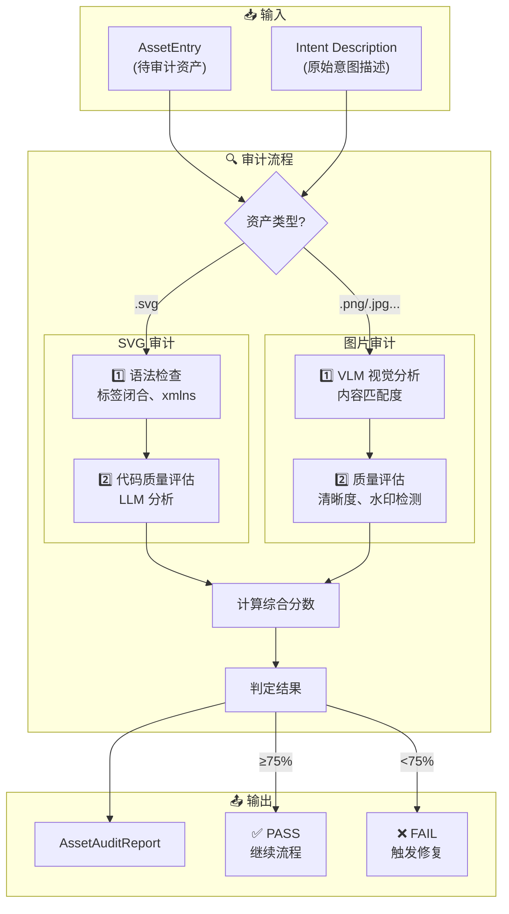
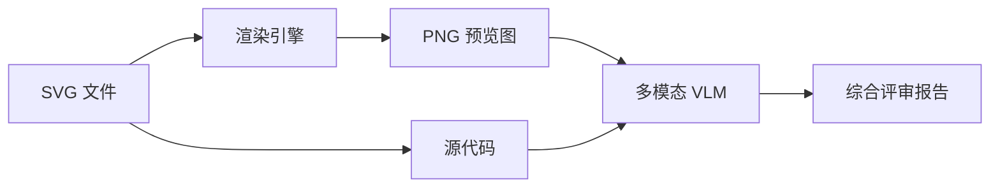
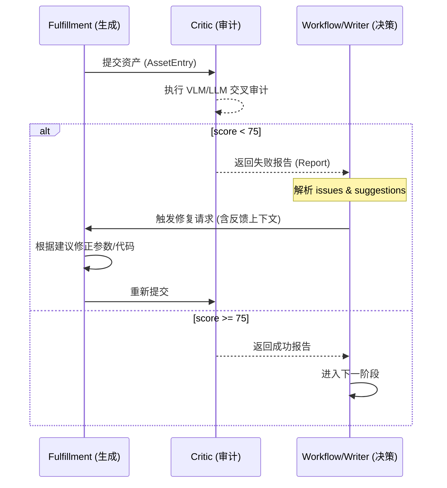

# 🔍 Asset Critic (资产审计员) 技术文档 - SOTA 2.0

## 1. 概述
**Asset Critic (资产审计员)** 是 SOTA 2.0 流程中的质量守门员（Phase D）。它的任务是验证 `AssetFulfillment` 生成的资产是否**真正符合原始意图描述**，并对视觉质量进行评分。审计失败的资产会触发修复循环。

---

## 2. 节点输入/输出规范 (I/O Specification)

### 📥 输入 (Inputs)
| 输入项 | 类型 | 来源 | 说明 |
| :--- | :--- | :--- | :--- |
| `asset` | `AssetEntry` | Fulfillment | 待审计的资产条目 |
| `intent_description` | `str` | Visual Directive | 原始意图描述 |
| `workspace_path` | `Path` | AgentState | 工作目录（用于解析相对路径） |

### 📤 输出 (Outputs)
| 输出项 | 类型 | 目的地 | 说明 |
| :--- | :--- | :--- | :--- |
| `AssetAuditReport` | `dataclass` | 编排层 | 审计报告（含分数、问题、建议） |
| `failed_assets` | `list[AssetEntry]` | 修复循环 | 需要重新生成的资产列表 |

---

## 3. 审计报告结构

```python
@dataclass
class AssetAuditReport:
    asset_id: str           # 资产 ID
    result: AuditResult     # PASS / FAIL / NEEDS_REVISION
    score: float            # 0-1 匹配分数
    issues: list[str]       # 发现的问题
    suggestions: list[str]  # 改进建议
    quality_assessment: str # 质量总结
```

### AuditResult 枚举
| 结果 | 分数阈值 | 说明 |
| :--- | :--- | :--- |
| `PASS` | ≥ 75% | 通过审计，可直接使用 |
| `NEEDS_REVISION` | 50-75% | 需要小幅修订 |
| `FAIL` | < 50% | 审计失败，需重新生成 |

---

## 4. 审计工作流



---

## 5. 评估维度

### 图片审计 (VLM)
| 维度 | 权重 | 说明 |
| :--- | :--- | :--- |
| 内容匹配度 | 40% | **通过 VLM 视觉感知**，核对图片元素与意图是否一致 |
| 视觉质量 | 30% | 清晰度、对比度、无水印、无视觉伪影 |
| 教学适用性 | 30% | 构图是否合理，是否适合作为教材配图 |

### SVG 审计 (双路交叉验证) 🆕

> ✅ **SOTA 2.0 升级**：SVG 审计现在同时进行**代码分析**和**渲染图视觉分析**。



#### 渲染策略 (优先级)
| 渲染引擎 | 适用场景 | 说明 |
| :--- | :--- | :--- |
| `cairosvg` | **优先** | 轻量级，无需浏览器，速度快 |
| `DrissionPage` | **回退** | 高保真，支持复杂动画和滤镜 |
| 纯代码模式 | **最终回退** | 渲染失败时，仅进行 LLM 代码分析 |

#### 评估维度
| 维度 | 权重 | 说明 |
| :--- | :--- | :--- |
| 内容匹配度 | 40% | **通过渲染图视觉检查**，确认图形是否符合意图描述 |
| 视觉质量 | 30% | 布局合理性、元素是否重叠、配色是否美观 |
| 代码质量 | 30% | 语法规范、命名空间、无冗余代码 |


---

## 6. SVG 语法检查

在调用 LLM 之前，审计员会进行本地语法检查：

```python
def check_svg_syntax(svg_code: str) -> list[str]:
    issues = []
    if not re.search(r'<svg[^>]*>', svg_code):
        issues.append("缺少 <svg> 开始标签")
    if not re.search(r'</svg>', svg_code):
        issues.append("缺少 </svg> 结束标签")
    if '<svg' in svg_code and 'xmlns' not in svg_code:
        issues.append("缺少 xmlns 声明")
    return issues
```

---

## 7. 修复循环与反馈模型 (Repair & Feedback)

当资产审计结果为 `FAIL` 或 `NEEDS_REVISION` 时，生成的 `AssetAuditReport` 将作为上下文反馈给上游生成节点。

### 7.1 反馈消费流
1. **收集反馈**: 审计员提取 `issues`（具体问题）和 `suggestions`（改进建议）。
2. **构建提示**: 编排层将这些反馈封装进 `RegenerationPrompt`。
3. **重新生成**:
   - 对于 **SVG/Mermaid**: 生成器根据“修正建议”重写代码。
   - 对于 **网络图片**: 搜索引擎尝试更换关键词或筛选更优质的源。
   - 对于 **用户素材**: 焦点计算器根据反馈重新调整裁切坐标。

### 7.2 修复逻辑图


### 7.3 修复边界
审计员不直接修改资产。它的唯一职责是**发现差异**并**定义改良路径**。修复工作始终由专业的生产节点（Fulfillment）执行，以保持职责单一性。

---

## 8. 示例审计报告

### 通过的报告
```json
{
  "asset_id": "s1-heart-structure",
  "result": "pass",
  "score": 0.88,
  "issues": [],
  "suggestions": [],
  "quality_assessment": "SVG 结构清晰，标注准确，配色适合教学"
}
```

### 失败的报告
```json
{
  "asset_id": "s2-blood-flow",
  "result": "fail",
  "score": 0.42,
  "issues": [
    "缺少血流方向箭头",
    "心室标注位置错误"
  ],
  "suggestions": [
    "添加红色箭头表示血流方向",
    "将 '左心室' 标注移至正确位置"
  ],
  "quality_assessment": "内容与意图描述不符，需重新生成"
}
```

---

## 9. 目录结构

```
src/agents/asset_management/
├── critic.py               # 🎯 审计员主文件
└── processors/
    └── audit.py            # VLM/LLM 审计调用逻辑
```

---

## 10. 使用示例

### 批量审计
```python
from src.agents.asset_management import AssetCriticAgent

critic = AssetCriticAgent(pass_threshold=0.75)
reports = await critic.batch_audit_async(
    assets_with_intents=[(asset1, "描述1"), (asset2, "描述2")],
    workspace_path=Path("workspace/job_001")
)

for report in reports:
    print(f"{report.asset_id}: {report.result.value} ({report.score:.0%})")
```

### 便捷函数
```python
from src.agents.asset_management.critic import audit_generated_assets_async

reports, failed = await audit_generated_assets_async(state, assets_with_intents)
print(f"通过: {len(reports) - len(failed)}, 失败: {len(failed)}")
```

---

## 11. 优势总结

| 特性 | 说明 |
| :--- | :--- |
| 🎯 **意图对齐** | 验证生成结果是否真正符合原始需求 |
| 🧪 **多维评估** | 同时评估内容、质量、适用性 |
| 🔄 **闭环修复** | 失败资产自动触发重新生成 |
| ⚡ **本地预检** | SVG 语法检查避免浪费 API 调用 |
