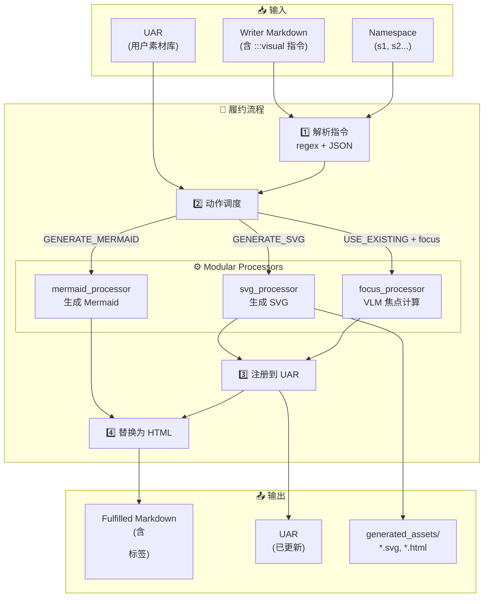
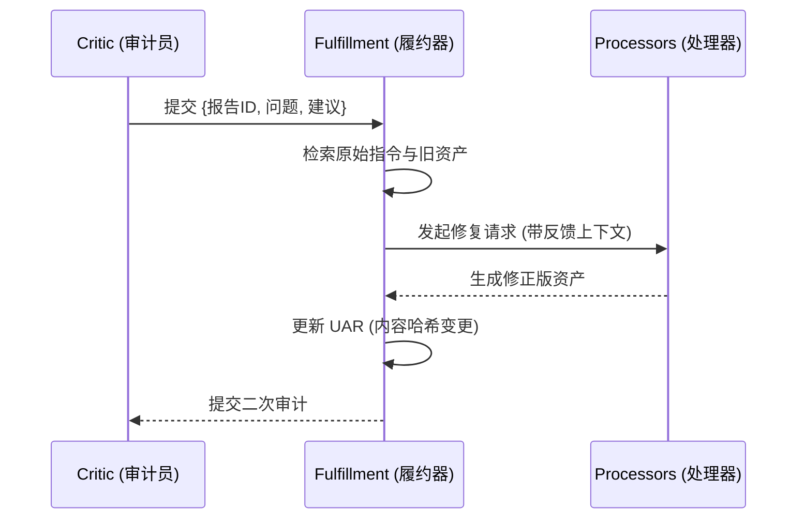
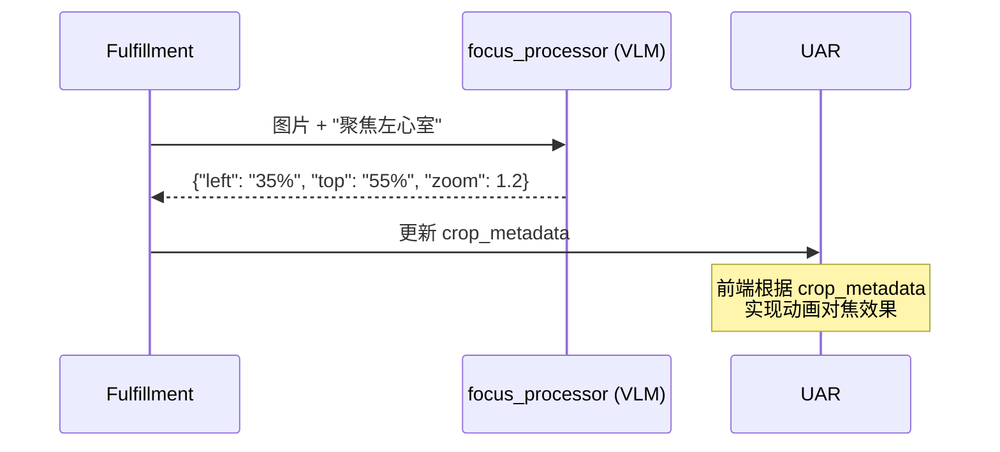

# 🖼️ Asset Fulfillment (资产履约) 技术文档 - SOTA 2.0

## 1. 概述
**Asset Fulfillment (资产履约)** 是 SOTA 2.0 流程中的核心自动化环节（Phase D）。它的任务是将 `Writer` 节点生成的"视觉意图桩" (`:::visual` 指令块) 转化为真实的、高质量的视觉资产（如 SVG 图形、Mermaid 图表或经过智能裁切的图片）。

---

## 2. 节点输入/输出规范 (I/O Specification)

### 📥 输入 (Inputs)
| 输入项 | 类型 | 来源 | 说明 |
| :--- | :--- | :--- | :--- |
| `section_content` | `str` | Writer 节点 | 包含 `:::visual` 指令的原始 Markdown |
| `namespace` | `str` | NamespaceManager | 当前章节命名空间（如 `s1`, `s2`） |
| `AgentState.asset_registry` | `UAR` | Phase 0 (AssetIndexer) | 已索引的用户素材库 |
| `AgentState.workspace_path` | `Path` | 编排层 | 工作目录，用于资产读写 |

### 📤 输出 (Outputs)
| 输出项 | 类型 | 目的地 | 说明 |
| :--- | :--- | :--- | :--- |
| `fulfilled_content` | `str` | 下游节点 (Critic/QA) | `:::visual` 已替换为 `<figure>` 的 Markdown |
| `AgentState.asset_registry` | `UAR (Updated)` | 持久化层 | 注册了新生成/使用的资产 |
| `AgentState.errors` | `list[str]` | 日志/监控 | 履约失败的错误信息 |

---

## 3. 核心协议：`:::visual` 指令块
`Writer` 在创作 Markdown 时，不直接嵌入图片链接，而是使用一种名为 **Visual Directive** 的声明式块：

```markdown
:::visual {"id": "s1-heart-structure", "action": "GENERATE_SVG", "focus": "左心室"}
这是一个描述心脏内部结构的视觉意图，需要标注瓣膜和心室名称。
:::
```

### 字段说明：
| 字段 | 类型 | 必填 | 说明 |
| :--- | :--- | :---: | :--- |
| `id` | `string` | ✅ | 资产唯一标识符（带命名空间前缀） |
| `action` | `enum` | ✅ | 履约动作类型（见下文） |
| `description` | `string` | ✅ | 视觉意图描述（作为 LLM 生成 Prompt） |
| `focus` | `string` | ❌ | VLM 焦点描述（用于智能裁切） |
| `style_hints` | `string` | ❌ | 风格暗示（配色、风格等） |
| `matched_asset_id` | `string` | ❌ | 已匹配的 UAR 资产 ID |

### Action 类型：
| Action | 说明 |
| :--- | :--- |
| `GENERATE_SVG` | 使用 LLM 生成教学级 SVG 矢量图 |
| `GENERATE_MERMAID` | 生成 Mermaid 流程图/时序图代码 |
| `USE_EXISTING` | 使用 UAR 中的现有素材 + VLM 焦点校准 |
| `SEARCH_WEB` | 从互联网搜索匹配素材（待增强） |
| `SKIP` | 跳过，保留占位符或忽略 |

---

## 4. 履约工作流 (Fulfillment Cycle)



---

## 5. 生成资产示例 (Asset Examples)

### 5.1 生成的 SVG 资产
```
generated_assets/
├── s1-heart-structure.svg   # 心脏结构图
├── s1-ecg-waveform.svg      # 心电图波形
└── s2-blood-flow.svg        # 血流示意图
```

### 5.2 UAR 中的资产条目
```json
{
  "id": "s1-heart-structure",
  "source": "AI",
  "local_path": "generated_assets/s1-heart-structure.svg",
  "semantic_label": "心脏内部结构，标注瓣膜和心室名称",
  "content_hash": "a3b2c1d4e5f6...",
  "crop_metadata": {
    "left": "45%",
    "top": "50%",
    "zoom": 1.0,
    "object_fit": "contain"
  },
  "usage_count": {"s1": 1},
  "tags": ["svg", "generated", "s1", "heart", "anatomy"]
}
```

## 6. 自校正与修复机制 (Self-Correction & Repair) 🔄

Fulfillment 不仅仅是单次生成的工具，它具备基于审计反馈的修复能力。

### 6.1 修复触发路径
1. **审计失败**: `AssetCritic` 返回 `FAIL` 状态及其反馈（报告单）。
2. **上下文增强**: Fulfillment 接收到反馈，并将其注入到相应的处理器（Processor）中。
3. **差异化修正**:
    * **SVG/Mermaid (代码级修复)**: 
        - **输入**: 原始描述 + 旧代码 + 审计问题列表。
        - **逻辑**: 使用“自修补”提示词，要求 LLM 针对性修改代码缺陷。
    * **VLM 焦点 (坐标级修复)**:
        - **输入**: 原始图片 + 审计反馈（如“焦点太靠上”）。
        - **逻辑**: 调整 VLM 采样区域，重新计算焦点中心。
    * **网络搜索 (策略级修复)**:
        - **逻辑**: 根据审计到的“内容不匹配”点，自动微调搜索引擎的 Keywords。

### 6.2 修复流程图


---

## 7. 智能焦点校准 (Focus Calibration) 🧠

这是 SOTA 2.0 的黑科技。当指令带有 `focus` 描述时：



---

## 7. 目录结构

```
src/agents/asset_management/
├── __init__.py           # 包导出
├── fulfillment.py        # 🎯 履约控制器 (本文档核心)
├── models.py             # VisualDirective 数据模型
├── utils.py              # HTML 渲染、路径解析
├── indexer.py            # Phase 0 资产索引器
├── critic.py             # Phase D 资产审计器
└── processors/           # ⚙️ 原子能力模块
    ├── svg.py            # SVG 生成
    ├── mermaid.py        # Mermaid 生成
    ├── vision.py         # Vision API 语义分析
    ├── focus.py          # VLM 焦点计算
    └── audit.py          # 资产匹配度审计
```

---

## 8. 优势总结

| 特性 | 说明 |
| :--- | :--- |
| 🎯 **意图驱动** | 作者只需表达"这里需要什么图"，无需关心获取细节 |
| ⏱️ **后期绑定** | 资产在 Markdown 稳定后才生产，减少 API 开销 |
| 🔄 **复用机制** | 通过 UAR 确保同一资产多处使用时的一致性 |
| 🧠 **智能裁切** | VLM 焦点计算解决传统图片的自适应裁剪痛点 |
| 🧩 **模块化** | Processors 可独立扩展（如未来支持视频、3D） |
