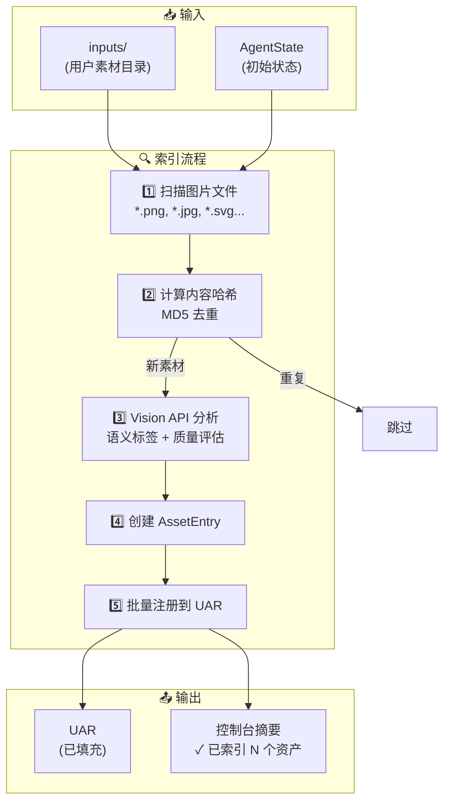

# 📦 Asset Indexer (资产索引器) 技术文档 - SOTA 2.0

## 1. 概述
**Asset Indexer (资产索引器)** 是 SOTA 2.0 流程中的"地基工程"（Phase 0）。它的任务是在创作开始前，扫描用户提供的所有素材，使用 **Vision API** 进行语义分析和质量评估，并将结果注册到 **UAR (Universal Asset Registry)**。

---

## 2. 节点输入/输出规范 (I/O Specification)

### 📥 输入 (Inputs)
| 输入项 | 类型 | 来源 | 说明 |
| :--- | :--- | :--- | :--- |
| `AgentState` | `AgentState` | 编排层 | 初始状态（UAR 为空） |
| `input_dir` | `str` | 配置 | 用户素材目录路径（默认 `inputs/`） |

### 📤 输出 (Outputs)
| 输出项 | 类型 | 目的地 | 说明 |
| :--- | :--- | :--- | :--- |
| `AgentState.asset_registry` | `UAR` | Writer / Fulfillment | 已索引的素材库 |
| `AgentState.errors` | `list[str]` | 日志 | 索引失败的错误信息 |

---

## 3. 工作流程



---

## 4. Vision API 分析

索引器调用 `vision_processor` 对每张图片进行多维度分析：

### 返回字段
| 字段 | 类型 | 说明 |
| :--- | :--- | :--- |
| `semantic_label` | `str` | 图片的语义描述（用于后续匹配） |
| `tags` | `list[str]` | 关键词标签（如 `["ecg", "heart"]`） |
| `quality_level` | `enum` | 质量等级：`HIGH`, `MEDIUM`, `LOW` |
| `quality_notes` | `str` | 质量问题说明 |
| `suitable_for` | `list[str]` | 适用场景 |
| `unsuitable_for` | `list[str]` | 不适用场景 |
| `suggested_focus` | `str` | 建议的视觉焦点位置 |

### 示例输出
```json
{
  "semantic_label": "心电图 P 波形成示意图",
  "tags": ["ecg", "p-wave", "cardiac", "diagram"],
  "quality_level": "HIGH",
  "quality_notes": "图片清晰，标注专业",
  "suitable_for": ["概念说明", "教学演示"],
  "unsuitable_for": ["临床诊断参考"],
  "suggested_focus": "中心偏左的心脏轮廓"
}
```

---

## 5. UAR 资产条目结构

每个索引的素材都会创建一个 `AssetEntry`：

```json
{
  "id": "u-ecg-pwave-001",
  "source": "USER",
  "local_path": "inputs/ecg_pwave.png",
  "semantic_label": "心电图 P 波形成示意图",
  "content_hash": "a1b2c3d4e5f6...",
  "crop_metadata": {
    "left": "30%",
    "top": "50%",
    "object_fit": "cover"
  },
  "tags": ["ecg", "p-wave", "cardiac"],
  "quality_level": "HIGH",
  "reuse_policy": "ALWAYS",
  "usage_count": {}
}
```

---

## 6. 支持的图片格式

| 格式 | 扩展名 |
| :--- | :--- |
| PNG | `.png` |
| JPEG | `.jpg`, `.jpeg` |
| GIF | `.gif` |
| WebP | `.webp` |
| SVG | `.svg` |
| BMP | `.bmp` |

---

## 7. 去重机制

索引器使用 **MD5 内容哈希** 进行去重：
1. 计算文件的 MD5 哈希值
2. 与 UAR 中已有资产的 `content_hash` 比对
3. 若已存在，跳过该文件并输出 `跳过重复: filename`

---

## 8. 目录结构

```
src/agents/asset_management/
├── indexer.py              # 🎯 索引器主文件
└── processors/
    └── vision.py           # Vision API 调用逻辑
```

---

## 9. 使用示例

### 便捷函数
```python
from src.agents.asset_management import index_user_assets

state = index_user_assets(state, input_dir="inputs")
print(state.asset_registry.to_summary())
```

### 异步调用
```python
from src.agents.asset_management import index_user_assets_async

state = await index_user_assets_async(state, client, input_dir="inputs")
```

---

## 10. 优势总结

| 特性 | 说明 |
| :--- | :--- |
| 🧠 **语义理解** | Vision API 自动生成人类可读的描述 |
| 🎯 **质量评估** | 自动识别低质量素材，避免影响产出 |
| 🔄 **自动去重** | 内容哈希确保相同素材只索引一次 |
| 📍 **焦点建议** | 预计算视觉重心，加速后续裁切 |
