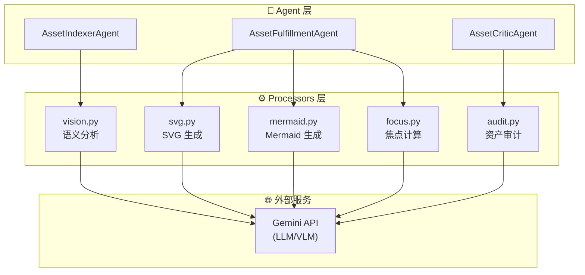

# ⚙️ Asset Processors (资产处理器) 技术文档 - SOTA 2.0

## 1. 概述
**Asset Processors** 是 Asset Management 模块的"原子能力层"。它们是独立的、可复用的函数模块，负责执行具体的资产生成、分析和审计任务。主 Agent（Indexer、Fulfillment、Critic）通过调用这些 Processors 来完成工作。

---

## 2. 模块架构



---

## 3. 各处理器详解

### 3.1 📷 Vision Processor (`vision.py`)

**用途**：分析图片内容，生成语义标签和质量评估。

#### 输入/输出
| 输入 | 输出 |
| :--- | :--- |
| `image_path: Path` | `semantic_label: str` |
| `client: GeminiClient` | `tags: list[str]` |
| | `quality_level: HIGH/MEDIUM/LOW` |
| | `suggested_focus: str` |

#### 核心函数
```python
async def analyze_image_async(client, image_path) -> dict
def analyze_image(client, image_path) -> dict
```

#### Prompt 概要
```
你是一个专业的图片内容分析师和质量评估师。
请分析这张图片并提供：
1. semantic_label: 一句简洁的中文描述
2. tags: 3-5 个关键词标签
3. quality_level: HIGH/MEDIUM/LOW
4. quality_notes, suitable_for, unsuitable_for, suggested_focus
```

---

### 3.2 🎨 SVG Processor (`svg.py`)

**用途**：根据文字描述生成教学级 SVG 矢量图。

#### 输入/输出
| 输入 | 输出 |
| :--- | :--- |
| `description: str` | `svg_code: str` (或 `None`) |
| `style_hints: str` | |
| `client: GeminiClient` | |

#### 核心函数
```python
async def generate_svg_async(client, description, style_hints) -> Optional[str]
def generate_svg(client, description, style_hints) -> Optional[str]
def extract_svg(text: str) -> Optional[str]  # 从 LLM 输出中提取 SVG
```

#### Prompt 概要
```
你是一个专业的 SVG 矢量图形设计师。
请根据以下描述生成一个教育性质的 SVG 图形：
- 简洁清晰，适合教学用途
- 使用柔和的配色方案
- 包含必要的标注和文字说明
直接输出完整的 SVG 代码。
```

---

### 3.3 📊 Mermaid Processor (`mermaid.py`)

**用途**：根据文字描述生成 Mermaid 图表代码。

#### 输入/输出
| 输入 | 输出 |
| :--- | :--- |
| `description: str` | `mermaid_code: str` (或 `None`) |
| `style_hints: str` | |
| `client: GeminiClient` | |

#### 核心函数
```python
async def generate_mermaid_async(client, description, style_hints) -> Optional[str]
def generate_mermaid(client, description, style_hints) -> Optional[str]
def extract_mermaid(text: str) -> Optional[str]  # 从 LLM 输出中提取
```

#### 支持的图表类型
- `flowchart` - 流程图
- `sequenceDiagram` - 时序图
- `classDiagram` - 类图
- `stateDiagram` - 状态图
- `erDiagram` - ER 图

---

### 3.4 🎯 Focus Processor (`focus.py`)

**用途**：使用 VLM 计算图片的最佳视觉焦点位置。

#### 输入/输出
| 输入 | 输出 |
| :--- | :--- |
| `image_path: Path` | `CropMetadata` (或 `None`) |
| `focus_description: str` | - `left: str` (如 "35%") |
| `client: GeminiClient` | - `top: str` (如 "55%") |
| | - `zoom: float` (如 1.2) |

#### 核心函数
```python
async def compute_focus_async(client, image_path, focus_description) -> Optional[CropMetadata]
def compute_focus(client, image_path, focus_description) -> Optional[CropMetadata]
```

#### Prompt 概要
```
分析这张图片，找到以下描述对应的视觉焦点位置：
焦点描述: {focus_description}

请返回焦点的百分比坐标：
{
  "left": "50%",
  "top": "50%",
  "zoom": 1.0,
  "reasoning": "简短解释"
}
```

---

### 3.5 🔍 Audit Processor (`audit.py`)

**用途**：验证生成的资产是否符合意图描述。

#### 输入/输出
| 输入 | 输出 |
| :--- | :--- |
| `image_path: Path` / `svg_code: str` | `dict` with: |
| `intent_description: str` | - `overall_score: int` (0-100) |
| `client: GeminiClient` | - `result: PASS/FAIL/NEEDS_REVISION` |
| | - `issues: list[str]` |
| | - `suggestions: list[str]` |

#### 核心函数
```python
async def audit_image_async(client, image_path, intent) -> Optional[dict]
async def audit_svg_async(client, svg_code, intent) -> Optional[dict]
def check_svg_syntax(svg_code: str) -> list[str]  # 本地语法预检
```

#### 评估维度
| 维度 | 说明 |
| :--- | :--- |
| 内容匹配度 | 是否准确表达意图中的核心概念 |
| 视觉质量 | 清晰度、对比度、无明显缺陷 |
| 教学适用性 | 是否适合用于教学文档 |

---

## 4. 目录结构

```
src/agents/asset_management/processors/
├── __init__.py    # 统一导出
├── vision.py      # 📷 Vision API 语义分析
├── svg.py         # 🎨 SVG 生成
├── mermaid.py     # 📊 Mermaid 生成
├── focus.py       # 🎯 VLM 焦点计算
└── audit.py       # 🔍 资产审计
```

---

## 5. 统一导出 (`__init__.py`)

```python
from .svg import SVG_GENERATION_PROMPT, extract_svg, generate_svg_async
from .mermaid import MERMAID_GENERATION_PROMPT, extract_mermaid, generate_mermaid_async
from .vision import VISION_TAGGING_PROMPT, analyze_image, analyze_image_async
from .focus import FOCUS_CALCULATION_PROMPT, compute_focus, compute_focus_async

__all__ = [
    "SVG_GENERATION_PROMPT", "extract_svg", "generate_svg_async",
    "MERMAID_GENERATION_PROMPT", "extract_mermaid", "generate_mermaid_async",
    "VISION_TAGGING_PROMPT", "analyze_image", "analyze_image_async",
    "FOCUS_CALCULATION_PROMPT", "compute_focus", "compute_focus_async",
]
```

---

## 6. 设计优势

| 特性 | 说明 |
| :--- | :--- |
| 🧩 **单一职责** | 每个 Processor 只做一件事 |
| 🔄 **同步/异步** | 所有 Processor 同时提供同步和异步接口 |
| 📦 **独立测试** | 可单独对每个 Processor 进行单元测试 |
| 🔌 **可扩展** | 易于添加新的 Processor（如视频处理、3D 模型） |
| 🎛️ **Prompt 外露** | 所有 Prompt 模板导出为常量，便于调优 |
