# 🧬 Magnum Opus HTML Agent

An enterprise-grade, multi-agent AI system architected for the autonomous production of **State-of-the-Art (SOTA)** technical documentation, academic textbooks, and interactive lectures.

---

## 🏗️ Core Workflows

The system decouples content production into two specialized professional pipelines:

### 1. [📝 Markdown Generation Pipeline](README_MARKDOWN.md)
**Focus: Phase A, B & D**
- **Clarification & Planning**: Clarifier & Architect Agents.
- **Deep Multimodal Writing**: SME Writer & Script Decorator Agents.
- **Asset Fulfillment & QA**: Asset Fulfillment, Asset Critic & Editorial QA.

### 2. [🎨 HTML Conversion Pipeline](README_HTML.md)
**Focus: Phase C & E**
- **SOTA Design System**: Design Tokens, CSS & JS Generators.
- **Visual Assurance**: Visual QA (VLM Critic & Code Fixer).

---

## 🏗️ High-Level Architecture

```mermaid
graph LR
    User([👤 User Intent]) --> PA[Phase A: Planning]
    PA --> PB[Phase B: Writing]
    PB --> PD[Phase D: Asset Closure]
    PD --> PC[Phase C: Transform]
    PC --> PE[Phase E: Verification]
    PE --> Done([✅ SOTA Document])

    style PA fill:#dbeafe,stroke:#2563eb
    style PB fill:#dbeafe,stroke:#2563eb
    style PD fill:#dbeafe,stroke:#2563eb
    style PC fill:#f9f5ff,stroke:#7c3aed
    style PE fill:#f9f5ff,stroke:#7c3aed
```



---

## 🚦 Getting Started

### 1. Setup
```bash
# Install dependencies
pip install -r requirements.txt
playwright install chromium
```

### 2. Usage
- **GUI Dashboard**: `streamlit run app.py` (Recommended)
- **CLI Mode**: `python main.py --input "Topic description"`

---

## 📂 Project Structure
```text
.
├── src/
│   ├── agents/          # Specialized AI agents
│   ├── core/            # SSE client, types, state
│   └── orchestration/   # LangGraph definitions
├── workspace/           # Persistent job storage
└── app.py               # Streamlit dashboard
```

## 📄 License
Internal SOTA Development Project. All Rights Reserved.
