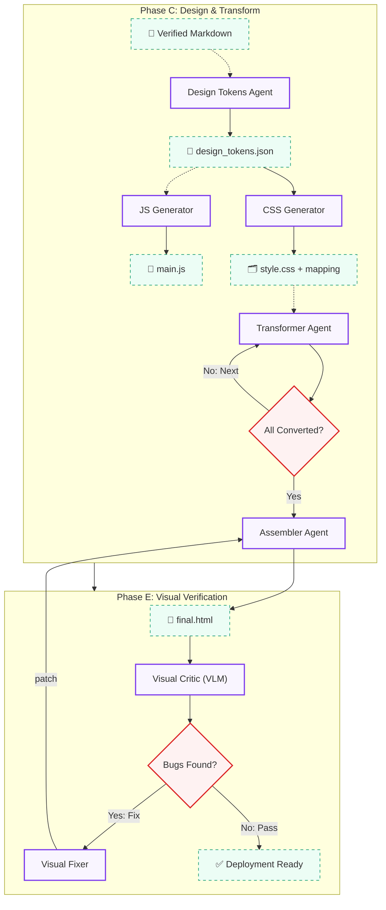

# 🎨 Magnum Opus: HTML Conversion & Visual QA (Visual Flow)

This is part of the Magnum Opus system, focusing on converting verified Markdown into SOTA-quality HTML5 outputs with high interactivity and visual QA auditing.

[← Back to Main Index](README.md) | [Go to Markdown Generation Pipeline →](README_MARKDOWN.md)

---

## 🏗️ Visual Pipeline Architecture: Phase C & E

---

## 🛠️ Specialized Agent Nodes (Design & Transform)

| Agent | Capability | Key SOTA Output |
| :--- | :--- | :--- |
| **Design Tokens** | Generates single-source-of-truth design token specification. | `design_tokens.json` |
| **CSS Generator** | Creates production CSS based on Design Tokens. | `style.css`, `style_mapping.json` |
| **JS Generator** | Creates interactive features (TOC, theme toggle, etc.). | `main.js` |
| **Transformer** | Strictly constrained Markdown-to-HTML compilation. | Styled HTML fragments (`sec-n.html`) |
| **Assembler** | Concatenates HTML fragments into final document. | `final.html` |
| **Visual QA Critic** | VLM-based inspection with **Chain-of-Verification**. | High-fidelity bounding box reports |
| **Code Fixer** | Surgical code patching based on visual failure coordinates. | Precise source code patches |

---

## 🔬 Deep Dive: Visual Flow Core Logic

### 1. Design Token Architecture
Following SOTA frontend practices, we decompose the design phase into three specialized agents. All visual decisions (brand colors, typography scales, spacing) are first defined in `design_tokens.json`, which is then read by CSS and JS generators. This ensures zero visual drift even in complex systems.

### 2. Contract-Driven Alignment (CDA)
To prevent JS from failing to find HTML elements or CSS selectors being orphaned, we implement a Selector Registration Contract. The Transformer refers to the selectors expected by the JS Generator to ensure 100% alignment.

### 3. Dual-Agent Visual QA
This is the "secret sauce" of Magnum Opus. Traditional agents are often "visually blind" to their output. Our Visual QA Critic renders the page in a headless browser, uses a VLM to find visual bugs (alignment, contrast, LaTeX overflows), and generates coordinate data to guide the Fixer in surgical patching.
