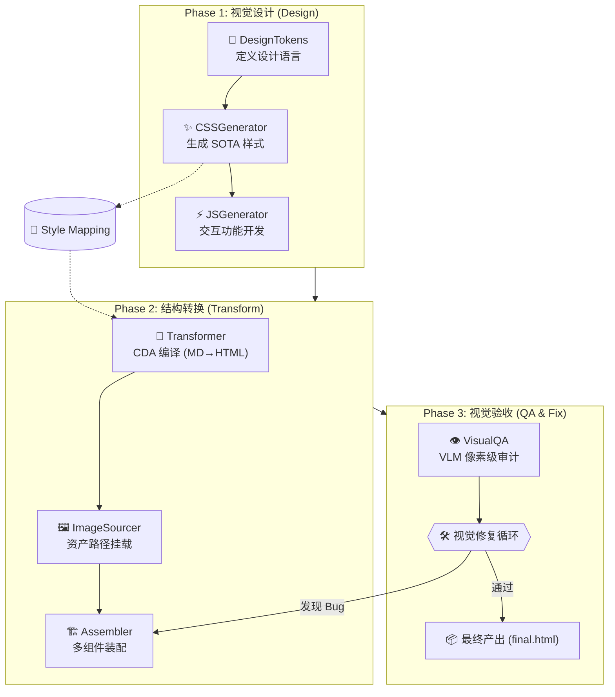

# 🎨 Magnum Opus: HTML 转换与视觉验收 (Visual Flow)

这是 Magnum Opus 系统的视觉引擎，专注于将验证后的语义 Markdown 转换为具备 SOTA 级视觉品质、交互性且经过 VLM 巡检的最终 HTML5 产物。它通过 **Design → Transform → QA** 三步走策略，确保内容与形式的完美融合。

[← 返回主索引](../README_CN.md) | [前往 Markdown 生成流水线 →](README_MARKDOWN_CN.md)

---

## 🏗️ 视觉工程流：从内容到像素

该流程在 Markdown 内容固化后启动，通过设计系统 (Design System) 的注入，实现从纯文本到富媒体网页的跃迁。

### 视觉执行流水线图



---

## 🔄 核心修复与再装配逻辑 (Reassembly)

不同于传统的单向生成，Magnum Opus 具备**视觉反馈回路**：

1. **视觉批评 (Visual QA)**：在 Headless 浏览器中渲染 HTML，VLM 扫描页面发现排版、颜色或布局缺陷。
2. **反馈重传**：修复建议被传回 `Assembler` 或 `Transformer`。
3. **外科手术式修补**：通过 `vqa_needs_reassembly` 状态位触发重新装配，最小化代码变更，精准修复视觉 Bug。

---

## 🎨 契约驱动对齐 (Contract-Driven Alignment)

为了保证生成的 HTML 能够完美适配生成的 CSS，我们引入了 **Style Mapping** 契约：

- **CSS 生成器** 输出 `style.css` 的同时，生成一份 `style_mapping.json`。
- **转换器 (Transformer)** 在处理 Markdown 笔记时，查阅 Mapping 契约，为特定的内容元素（如 `:::info` 容器）注入正确的类名。
- 这避免了 Agent 生成随机类名导致的样式丢失。

---

## 📊 数据契约与产物状态

| SSOT 组件 | 文件载体 | 核心职责 | 对应 Agent |
|:---------|:---------|:---------|:------------|
| **设计令牌** | `design_tokens.json` | 存储颜色、字体、间距等原子级变量 | `DesignTokensAgent` |
| **样式表** | `assets/style.css` | 全局响应式布局与美化脚本 | `CSSGeneratorAgent` |
| **交互脚本** | `assets/main.js` | 滚动动画、TOC 导航、图画廊交互 | `JSGeneratorAgent` |
| **HTML 片段** | `html/sec-*.html` | 遵循 CDA 协议的分布式 HTML 构件 | `TransformerAgent` |
| **装配蓝图** | `AgentState.vqa_report` | 记录视觉缺陷位置与修复指令 | `VisualQAAgent` |

---

## 🤖 核心 Agent 节点详解

| Agent | 职责 | 核心输出 |
|:------|:-----|:---------|
| **DesignTokens** | 确定品牌视觉调性与响应式参数 | 设计变量 (JSON) |
| **CSSGenerator** | 编写高度解化的原子 CSS 与 Component CSS | `style.css` |
| **JSGenerator** | 为章节定制交互脚本（如推导过程步进器） | `main.js` |
| **Transformer** | 语义级编译，确保 Markdown 指令完美转化为 HTML | `sections/` |
| **VisualQA** | VLM 驱动的“找茬”任务，识别坐标级 Bug | 审计报告 (PDF/PNG) |

---

## 🚀 启动 HTML 转换

如果你已经拥有了 `manifest.json` 和对应的 `md/` 文件夹，可以执行独立转换流：

```bash
# 运行仅生成模式 (Writer -> Assembler -> VisualQA)
python main.py --mode generate --job_id <existing_id>
```

产物路径：`workspace/{job_id}/final.html`

---

## 🔗 相关链接
- [← 返回主索引](../README_CN.md)
- [前往 Markdown 生成流水线 →](README_MARKDOWN_CN.md)
- [开发者进阶指南](../CLAUDE.md)
