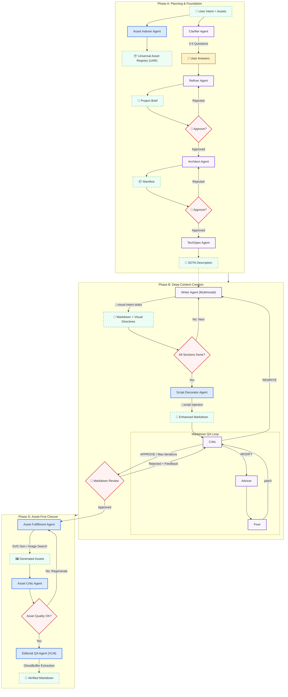

# 🧬 Magnum Opus: Markdown Generation Pipeline (Semantics Flow)

This is part of the Magnum Opus system, focusing on the generation of high-quality, structured Markdown content from user intent. It covers requirements clarification, structural planning, multimodal writing, asset fulfillment, and editorial QA.

[← Back to Main Index](README.md) | [Go to HTML Conversion Pipeline →](README_HTML.md)

---

## 🏗️ Semantic Pipeline Architecture: Phase A, B & D

---

## 🛠️ Specialized Agent Nodes (Semantics & Assets)

| Agent | Capability | Key SOTA Output |
| :--- | :--- | :--- |
| **Asset Indexer** | Scans user assets, generates semantic labels and quality assessments via VLM. | `assets.json` (UAR) |
| **Clarifier** | Ambiguity resolution via 3-5 targeted questions. | `clarification_questions.json` |
| **Refiner** | Synthesizes user input + clarification into structured Project Brief. | Project Brief (Markdown) |
| **Architect** | Intellectual hierarchy design; prevents "shallow" content. | `manifest.json` |
| **TechSpec** | Generates execution contract with design specs and interactivity requirements. | SOTA Description |
| **Writer** | Full-context multimodal writer; outputs `:::visual` intent stubs. | Markdown + Visual Directives |
| **Script Decorator** | Identifies interactive elements, injects `:::script` directive blocks. | Enhanced Markdown |
| **Markdown QA** | AI self-correction + Human-in-the-Loop review of Markdown content. | Validated Markdown |
| **Asset Fulfillment** | Parses `:::visual` directives, executes SVG generation/image search. | Fulfilled Assets |
| **Asset Critic** | VLM visual matching audit, verifies assets match intent descriptions. | Audit Reports |
| **Editorial QA** | Full semantic review + GhostBuffer skeleton extraction. | Semantic Summary |

---

## 📊 Data Contract Details

### Phase 1: Planning Agents

#### 1. Clarifier Agent
- **Input**: `AgentState.raw_materials`, `AgentState.images`, `AgentState.reference_docs`
- **Output**: `AgentState.clarifier_questions` (`list[ClarificationQuestion]`)

#### 2. Refiner Agent
- **Input**: `AgentState.raw_materials`, `AgentState.clarifier_answers`, `AgentState.user_brief_feedback`
- **Output**: `AgentState.project_brief`

#### 3. Outline Agent
- **Input**: `AgentState.project_brief`, `AgentState.user_outline_feedback`
- **Output**: `AgentState.manifest` (outline.json)

---

## 🔬 Deep Dive: Semantic Flow Core Logic

### 1. Full-Context Awareness
The Writer node doesn't just see the current section outline; it has access to all previously generated Markdown sections. This ensures terminology consistency and logical coherence across long documents.

### 2. Intent-Driven Asset Production
Magnum Opus 2.0 no longer generates image URLs directly. Instead, the Writer generates "Visual Intents". These intents are fulfilled in Phase D by specialized agents that decide whether to generate precise SVG code or search for high-quality photos.

### 3. Human-in-the-Loop Propagation
Strategic checkpoints at Brief, Outline, and Markdown phases allow users to steer the AI. Feedback is propagated back to the respective agents with high priority.
