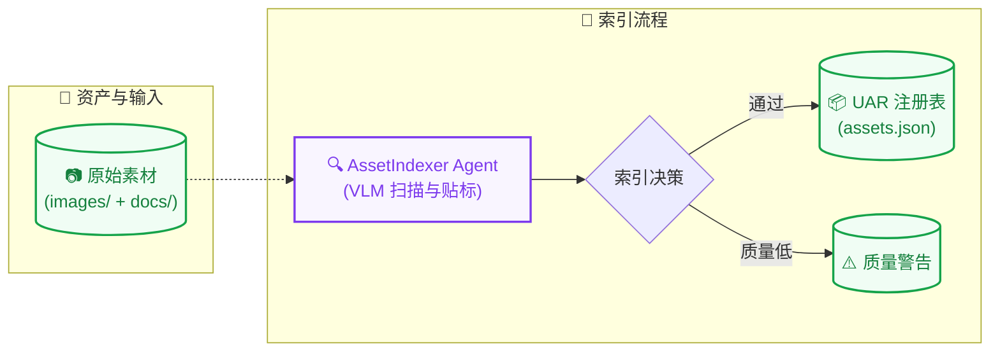
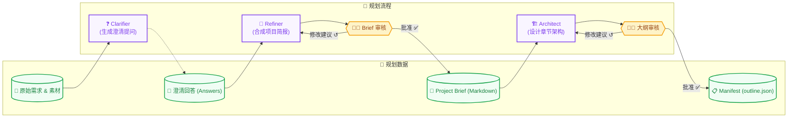
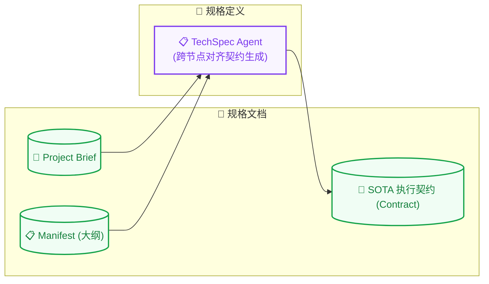
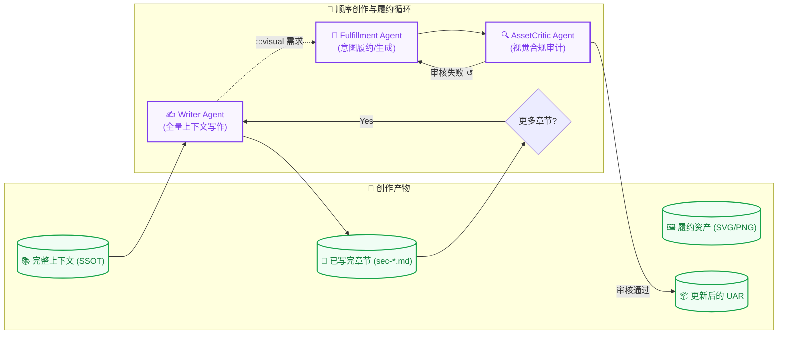
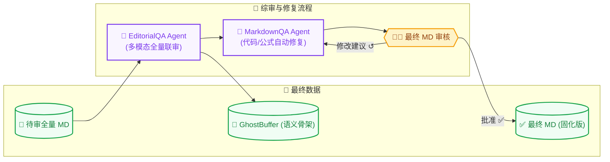
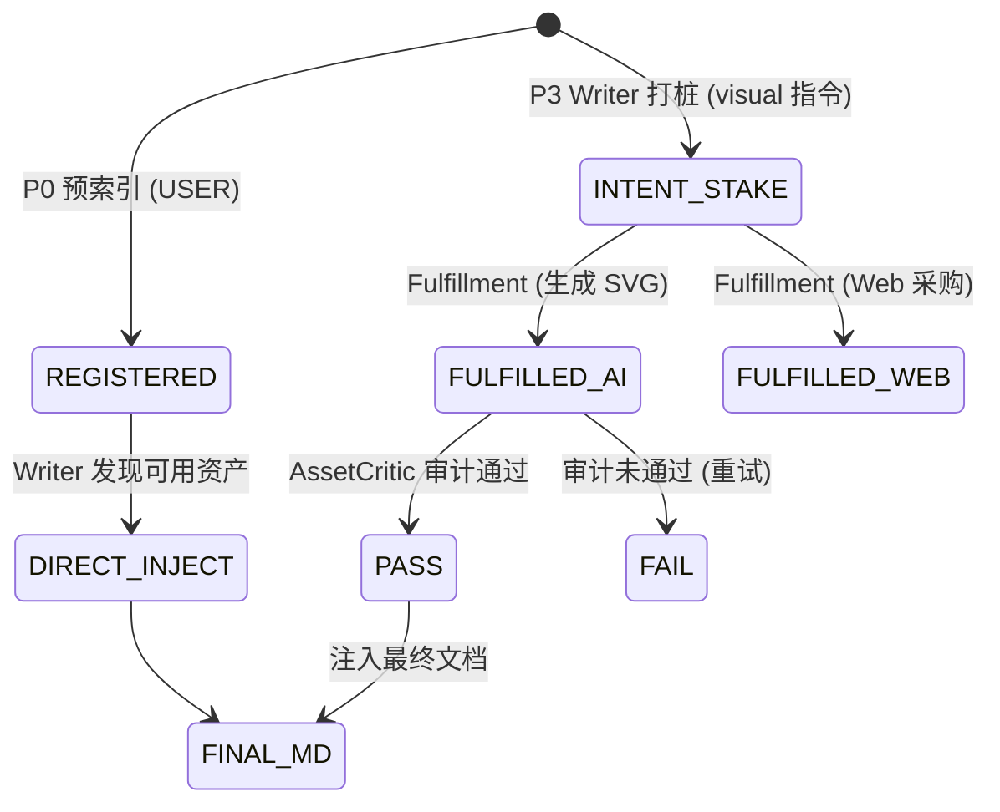

# 🧬 Magnum Opus: SOTA 2.0 语义创作流水线 (Markdown Flow)

这是 Magnum Opus 系统最核心的语义大脑，负责从原始灵感到高质量、结构化内容的转化。系统通过五个高度专业化的阶段 (Phase 0-4) 运行。

[← 返回主索引](../README_CN.md) | [前往 HTML 转换流水线 →](README_HTML_CN.md)

---

## 🏗️ 核心架构：分阶段详细深度视图

我们采用了 **“左侧数据/资产 (Data) - 右侧执行流 (Workflow)”** 的分块设计，确保数据驱动的逻辑清晰透明。

### 🟢 Phase 0: 资产索引评估 (Asset Indexing)
**核心逻辑**：在开始协作前，先让 AI “看一眼”你提供了哪些素材，并进行语义贴标。



---

### 🔵 Phase 1: 需求深度规划 (Planning)
**核心逻辑**：通过 3 轮交互，将模糊的需求变成精确的目录架构。



---

### 🟡 Phase 2: 技术规格定义 (TechSpec)
**核心逻辑**：在动笔前，确定所有的排版规范和交互规则，作为后续“协作契约”。



---

### 🟠 Phase 3: 章节创作与资产闭环 (Creation)
**核心逻辑**：最繁忙的阶段，一边顺序写作，一边动态生成/采购资产并进行审计。



---

### 🔴 Phase 4: 全量语义综审 (QA)
**核心逻辑**：最后把关，修正数学公式错误、结构断裂及冗余。



---

## 📦 资产状态机：UAR 核心决策链

在 Phase 3 的创作中，资产的状态如何流转：



---

## 🚀 启动命令

```bash
# 执行独立语义生成
python main_markdown.py --input inputs/prompt.txt
```

---

## 🔗 相关手册
- [← 返回主索引](../README_CN.md)
- [前往 HTML 转换流水线 →](README_HTML_CN.md)
