# 🧬 SOTA 2.0 断点结构测试策略 (Data-Gated Protocol)

本方案定义了 Magnum Opus HTML 引擎在生产 Markdown 过程中的核心验证点（Gates）。每个断点都旨在拦截特定阶段的“幻觉”扩散，确保生产流的物理一致性。

## 📊 断点全景图

```mermaid
%%{init: {'theme': 'base', 'themeVariables': { 'primaryColor': '#e1f5fe', 'edgeLabelBackground':'#ffffff', 'tertiaryColor': '#fff'}}}%%
graph TD
    %% 定义全局样式
    classDef Gate fill:#fff3e0,stroke:#e65100,stroke-width:2px,stroke-dasharray: 5 5,color:#e65100;
    classDef Process fill:#f5f5f5,stroke:#333,stroke-width:1px;
    classDef Data fill:#e8f5e9,stroke:#2e7d32,stroke-width:1px,font-weight:bold;

    subgraph "Phase I: 认知对齐门 (Cognitive Alignment)"
        A[原始素材/意图] --> P1(Asset Indexer)
        P1 --> G1{{BP-1: 原始资产指纹锁}}
        G1 -.-> |验证| D1[UAR Seed: 物理哈希与初步语义]
        D1 --> P2(Architect)
        P2 --> G2{{BP-2: 逻辑骨架锁}}
        G2 -.-> |验证| D2[Manifest: Namespace/Metadata 注入]
    end

    subgraph "Phase II: 语义生产门 (Semantic Production)"
        D2 --> P3(Subject SME Writer)
        P3 --> G3{{BP-3: 创作决策锁}}
        G3 -.-> |验证| D3[Raw MD: Writer-Direct-Inject 协议执行率]
        D3 --> P4(Script Decorator)
        P4 --> G4{{BP-4: 静态语法锁}}
        G4 -.-> |验证| D4[Final MD: :::script JSON 闭合性/合法性]
    end

    subgraph "Phase III: 物理履约门 (Physical Grounding)"
        D4 --> P5(Fulfillment: Strategy)
        P5 --> G5{{BP-5: 履约策略锁}}
        G5 -.-> |验证| D5[Task Queue: 去重逻辑与生产优先级]
        D5 --> P6(Fulfillment: Production)
        P6 --> G6{{BP-6: 物理资产锁}}
        G6 -.-> |验证| D6[Assets: SVG 语法/网络图片物理落地]
        D6 --> P7(VLM Focus Calculator)
        P7 --> G7{{BP-7: 视觉焦点锁}}
        G7 -.-> |验证| D7[UAR Update: Crop Metadata 百分比坐标]
    end

    subgraph "Phase IV: 终审回溯门 (Final Audit)"
        D7 --> P8(Editorial QA)
        P8 --> G8{{BP-8: 语义一致性锁}}
        G8 -.-> |验证| D8[QA Report: 图文描述 1:1 匹配度]
        D8 --> P9(Persistence)
        P9 --> G9{{BP-9: 实验闭环锁}}
        G9 -.-> |验证| D9[Project Profile: 全量 Prompt/数据快照]
    end

    %% 状态与数据关联
    class G1,G2,G3,G4,G5,G6,G7,G8,G9 Gate;
    class P1,P2,P3,P4,P5,P6,P7,P8,P9 Process;
    class D1,D2,D3,D4,D5,D6,D7,D8,D9 Data;

    %% 关键说明
    note1[SOTA 断点核心: 拦截幻觉扩散]
    note1 --- G3
    note2[视觉核心断点: 坐标回写校验]
    note2 --- G7
```

---

## 🔬 断点详细说明 (Gate Specifications)

### [BP-3] 创作决策锁 (The Decision Hub)
*   **触发点**: `WriterAgent` 完成 Markdown 创作。
*   **验证核心**: **Writer-Direct-Inject** 协议的执行率。
*   **观察项**: 检查写手是否正确引用了 UAR 中的现有资产（使用 `USE_EXISTING`），还是由于幻觉盲目要求生成新资产。这是拦截成本扩散的关键点。

### [BP-5] 履约策略锁 (The Fulfillment Map)
*   **触发点**: `AssetFulfillmentAgent` 完成全书指令解析，发起物理请求前。
*   **验证核心**: **任务去重与优先级逻辑**。
*   **观察项**: 验证跨章节资产请求是否已合并，避免重复拉取或生成相同的视觉概念。

### [BP-7] 视觉焦点锁 (Visual Truth)
*   **触发点**: 图片下载或 SVG 生成完毕，VLM 完成焦点计算后。
*   **验证核心**: **像素到坐标的语义转化**。
*   **观察项**: 检查 `AssetEntry.crop_metadata`。百分比坐标（如 `left: 30%`）必须精准击中文字描述中的医疗/技术重点区域。

### [BP-9] 实验闭环锁 (The Audit Trail)
*   **触发点**: 整个 Workflow 结束，持久化执行前。
*   **验证核心**: **Profile 的可复现性**。
*   **观察项**: 核验 `profile.json` 是否记录了全量 Prompt 快照和 UAR Checkpoint。确保实验可以被无损回溯和局部重写。
